# CHAPTER 4: DESIGN AND IMPLEMENTATION

> **Project:** VulnTriage — AI-Assisted Vulnerability Triage and Confirmation System Using ML and Multi-Scanner Analysis
> **Development model:** Object-Oriented Analysis and Design (OOAD). The UML diagrams below (use case, activity, sequence, class) and the ERD follow this methodology.
>
> *Diagrams are written in Mermaid and render on GitHub, in VS Code (with a Mermaid extension), or at mermaid.live. All screenshots are real captures of the running web application. A Word (.docx) build of this chapter, with every diagram rasterised to an image, is provided alongside this file.*

---

## 4.1 Introduction

### 4.1.1 Purpose of the Chapter

This chapter documents both the **design** and the completed **implementation** of VulnTriage. Where the earlier chapters established *what* the system needed to do and *why*, this chapter shows *how* the system was realised: the architecture that structures it, the models that describe its behaviour and data, the interface through which an analyst operates it, and the finished artefacts (screens and reports) it produces. Every design artefact is accompanied by an explanation of the decisions behind it, so that the chapter can be read as a self-contained account of the system's construction.

### 4.1.2 Problem Recap and the System's Role

Automated vulnerability scanners are effective at *breadth* — they probe a target with hundreds of checks and emit large volumes of findings — but they are notoriously weak at *precision*. A typical scan report mixes a handful of genuine, exploitable weaknesses with a much larger number of low-value or spurious findings (missing headers, informational disclosures, version-based guesses, and outright false positives). Security analysts therefore spend a disproportionate share of their time manually sifting reports, a task that does not scale and that suffers from fatigue-driven error.

VulnTriage addresses this by acting as an **intelligent triage layer that sits after the scanners**. It does not attempt to replace ZAP, Nuclei, or Nessus; instead it *consumes* their output and applies a sequence of automated reasoning steps — normalisation, de-duplication, enrichment, machine-learning prioritisation, confidence scoring, and optional active proof-of-concept validation — to transform a raw, noisy report into a **prioritised, confidence-scored, and evidence-backed shortlist**. The distinctive contribution is the **Confidence Engine**, which estimates the probability that a finding is a *true positive* (worth an analyst's attention) rather than merely how *severe* it would be if real.

### 4.1.3 Methodology and Its Design Artefacts

The system was designed using **Object-Oriented Analysis and Design (OOAD)**. OOAD was chosen because the problem domain decomposes naturally into objects with clear responsibilities: persistent domain entities (users, uploads, findings, scores, reports) and behavioural service objects (the pipeline engines). This decomposition maps directly onto the Python class model used in the implementation and onto the standard set of UML artefacts that OOAD prescribes. Consequently, this chapter presents:

- a **use case diagram** capturing the actors and the functions they invoke (§4.2.3);
- an **activity diagram** modelling the control flow of the triage pipeline (§4.2.4);
- two **sequence diagrams** modelling the object interactions for the two principal workflows (§4.2.5);
- a **class diagram** describing the static structure of the domain and service objects (§4.2.6);
- **data flow diagrams** at two levels of abstraction (§4.2.7); and
- an **entity-relationship diagram** describing the persistent schema (§4.3).

### 4.1.4 Summary of What Was Implemented

The completed system comprises a **Flask + SQLAlchemy** backend exposing a JWT-secured REST API; a **React 18 + Vite + Tailwind** single-page front end; a **pure-NumPy Random Forest** machine-learning model for severity prioritisation; a suite of nine independent pipeline engines; parsers for three scanner formats; and a PDF report generator. It runs, from a single codebase, in three deployment modes — a native desktop application, a Dockerised web application, and a command-line interface — and is backed by a nine-table relational schema that operates on either PostgreSQL or SQLite.

---

## 4.2 Design

### 4.2.1 Design Principles and Patterns

The design is governed by five principles that recur throughout the system and explain most of its structural decisions.

1. **Separation of scanning from triage.** The core competence of the system is *triage*, so scanners are treated as interchangeable *sources* rather than as parts of the system. Each scanner has its own parser that converts a native report into a common `Vulnerability` record; from that point on, every engine is scanner-agnostic. This makes it trivial to add a new scanner (write one parser) without touching the analytical pipeline.

2. **Single-responsibility engine services (the pipeline pattern).** Each analytical stage is implemented as a self-contained class that performs exactly one transformation: it reads findings from the database, applies its logic, and writes the results back. Because the stages communicate only through the shared data store and not directly with one another, the pipeline can be tested stage-by-stage, reordered, or extended, and the identical engines are reused by all three front ends.

3. **Offline-first enrichment.** External reference data (the National Vulnerability Database) is consumed from **local compressed feeds streamed with constant memory**, so enrichment functions without internet access; the live NVD API is retained only as a fallback. This is a deliberate robustness decision for an environment where outbound network access is restricted.

4. **Explainability by construction.** The system never emits an unexplained verdict. The Confidence Engine records, for every finding, a per-factor breakdown and a human-readable rationale, which are surfaced identically in the user interface and in the PDF report. This makes the automated judgement auditable — essential for a security tool whose recommendations drive analyst action.

5. **Responsible, authorised operation.** Any capability that generates outbound traffic to a target — the optional Auto Scan and the active PoC checks — is gated behind an explicit authorisation acknowledgement and, for PoC probes, a host **scope guard** that suppresses requests to out-of-scope hosts.

### 4.2.2 System Architecture

VulnTriage adopts a **layered, service-oriented architecture** with four tiers and a set of supporting resources. Figure 4.1 shows the arrangement.

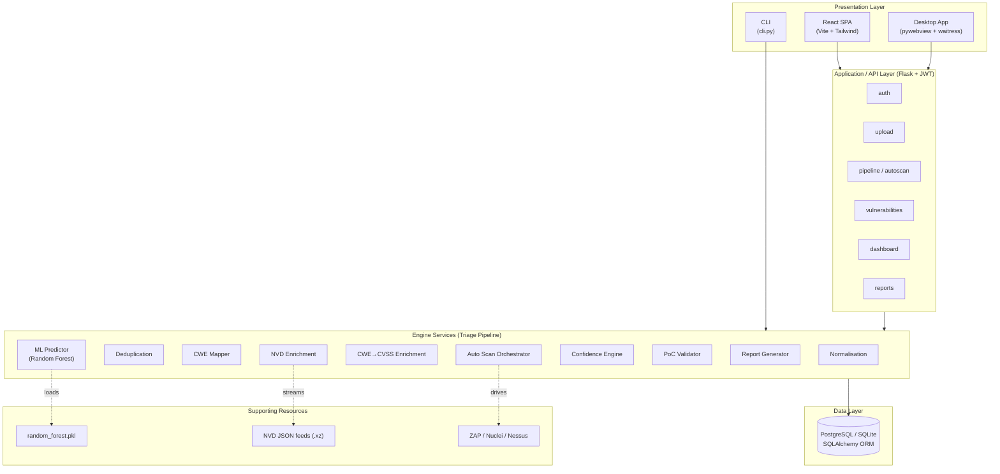
```mermaid
flowchart TB
    subgraph PRES["Presentation Layer"]
        WEB["React SPA<br/>(Vite + Tailwind)"]
        DESK["Desktop App<br/>(pywebview + waitress)"]
        CLI["CLI<br/>(cli.py)"]
    end

    subgraph API["Application / API Layer (Flask + JWT)"]
        AUTH["auth"]
        UPL["upload"]
        PIPE["pipeline / autoscan"]
        VULN["vulnerabilities"]
        DASH["dashboard"]
        REP["reports"]
    end

    subgraph ENG["Engine Services (Triage Pipeline)"]
        NORM["Normalisation"]
        DEDUP["Deduplication"]
        CWEM["CWE Mapper"]
        NVD["NVD Enrichment"]
        CVSSE["CWE→CVSS Enrichment"]
        ML["ML Predictor<br/>(Random Forest)"]
        CONF["Confidence Engine"]
        POC["PoC Validator"]
        RPT["Report Generator"]
        ORCH["Auto Scan Orchestrator"]
    end

    subgraph DATA["Data Layer"]
        DB[("PostgreSQL / SQLite<br/>SQLAlchemy ORM")]
    end

    subgraph RES["Supporting Resources"]
        MODEL["random_forest.pkl"]
        FEEDS["NVD JSON feeds (.xz)"]
        SCAN["ZAP / Nuclei / Nessus"]
    end

    WEB --> API
    DESK --> API
    CLI --> ENG
    API --> ENG
    ENG --> DB
    ML -. loads .-> MODEL
    NVD -. streams .-> FEEDS
    ORCH -. drives .-> SCAN
```

**Figure 4.1: System Architecture**

The four tiers are as follows.

- **Presentation layer.** Three front ends provide interchangeable access to the same functionality. The React single-page application is the primary interface; the desktop application wraps the same compiled front end in a native window using pywebview and a waitress server; and the command-line interface offers scriptable, headless access for automation. The web and desktop clients communicate with the backend exclusively over the REST API, whereas the CLI invokes the engine services directly in-process.

- **Application / API layer.** Implemented in Flask and organised as six blueprints (`auth`, `upload`, `pipeline`, `vulnerabilities`, `dashboard`, `reports`), this layer authenticates requests via JSON Web Tokens, validates input, and orchestrates the engine services. It is deliberately thin: it contains coordination logic but no analytical logic, which lives entirely in the engine layer.

- **Engine services (the triage pipeline).** This is the analytical core: nine pipeline engines plus the Auto Scan orchestrator and the scanner runner. Each engine is a single-responsibility class (detailed in §4.5.2).

- **Data layer.** All state is persisted through the SQLAlchemy Object-Relational Mapper, which abstracts over the choice of PostgreSQL (for the web deployment) or SQLite (for the desktop and CLI deployments). Because the models use only generic column types, the same schema runs unchanged on both engines.

- **Supporting resources.** Three external resources support the pipeline: the serialised Random Forest model that the ML predictor loads, the compressed NVD feeds that the enrichment engine streams, and the scanner binaries that the Auto Scan orchestrator drives.

### 4.2.3 Use Case Diagram

The system has one primary human actor, the **Security Analyst**, and two supporting (non-human) actors: the **Scanner Tools** that are driven during Auto Scan, and the **NVD Data Source** consulted during enrichment. Figure 4.2 shows the use cases.

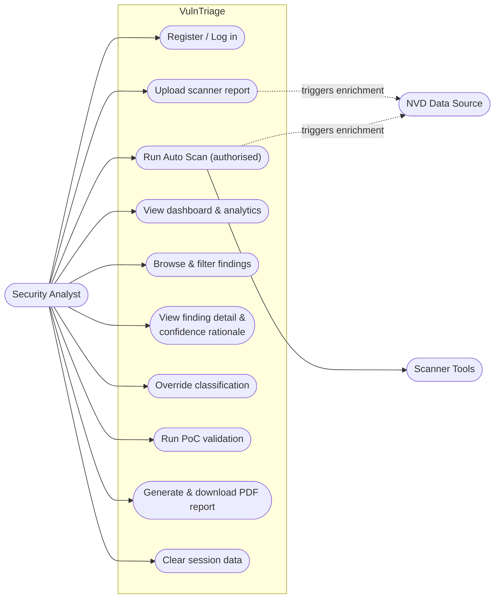
```mermaid
flowchart LR
    ANALYST(["Security Analyst"])
    SCANNERS(["Scanner Tools"])
    NVDSRC(["NVD Data Source"])

    subgraph SYSTEM["VulnTriage"]
        UC1(["Register / Log in"])
        UC2(["Upload scanner report"])
        UC3(["Run Auto Scan (authorised)"])
        UC4(["View dashboard & analytics"])
        UC5(["Browse & filter findings"])
        UC6(["View finding detail &<br/>confidence rationale"])
        UC7(["Override classification"])
        UC8(["Run PoC validation"])
        UC9(["Generate & download PDF report"])
        UC10(["Clear session data"])
    end

    ANALYST --> UC1 & UC2 & UC3 & UC4 & UC5 & UC6 & UC7 & UC8 & UC9 & UC10
    UC3 --> SCANNERS
    UC2 -. triggers enrichment .-> NVDSRC
    UC3 -. triggers enrichment .-> NVDSRC
```

**Figure 4.2: Use Case Diagram**

Each use case is described below, including its precondition and its main outcome, so that the intended behaviour is unambiguous.

| # | Use case | Precondition | Description and outcome |
|---|----------|--------------|-------------------------|
| UC1 | Register / Log in | — | The analyst creates an account or authenticates with an email and password. On success the API issues a JWT that authorises all subsequent requests. |
| UC2 | Upload scanner report | Authenticated | The analyst submits a ZAP XML, Nuclei JSONL, or Nessus `.nessus` file. The system parses it and runs the full triage pipeline, producing normalised, scored findings. |
| UC3 | Run Auto Scan | Authenticated; authorisation acknowledged | The system drives ZAP and Nuclei against a specified target, then triages the combined output. Requires an explicit authorisation acknowledgement because active scanning is intrusive. |
| UC4 | View dashboard | Authenticated; data present | The analyst sees aggregate metrics: totals, severity and classification breakdowns, scans-by-tool, and the highest-CVSS findings. |
| UC5 | Browse & filter findings | Authenticated; data present | The analyst lists, searches, and filters normalised findings by severity and classification. |
| UC6 | View finding detail | A finding selected | The analyst inspects a finding's confidence score, six-factor breakdown and rationale, ML prediction, CVSS metrics, description/solution, and PoC evidence. |
| UC7 | Override classification | Viewing a finding | The analyst manually sets a finding's classification when professional judgement differs from the automated verdict. |
| UC8 | Run PoC validation | Findings with testable URLs; in scope | The system performs non-destructive proof-of-concept checks against authorised targets; a confirmed check overrides the classification to *Confirmed*. |
| UC9 | Generate & download report | Data present | The system renders a PDF triage report, which the analyst downloads. |
| UC10 | Clear session data | Authenticated | The analyst resets the workspace to begin a fresh triage session. |

### 4.2.4 Activity Diagram — The Triage Pipeline

The central behaviour of the system is the triage pipeline. Figure 4.3 models it as an activity flow, from an ingested report to a finished PDF report, including the two conditional branches (optional exploit lookup and optional PoC validation) and the proof-of-concept confirmation override.

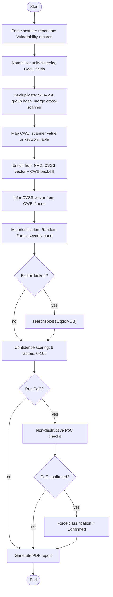
```mermaid
flowchart TD
    START([Start]) --> P["Parse scanner report into Vulnerability records"]
    P --> N["Normalise: unify severity, CWE, fields"]
    N --> D["De-duplicate: SHA-256 group hash, merge cross-scanner"]
    D --> C["Map CWE: scanner value or keyword table"]
    C --> E["Enrich from NVD: CVSS vector + CWE back-fill"]
    E --> V["Infer CVSS vector from CWE if none"]
    V --> ML["ML prioritisation: Random Forest severity band"]
    ML --> EX{"Exploit lookup?"}
    EX -->|yes| SS["searchsploit (Exploit-DB)"]
    EX -->|no| SC["Confidence scoring: 6 factors, 0-100"]
    SS --> SC
    SC --> PD{"Run PoC?"}
    PD -->|no| RPT["Generate PDF report"]
    PD -->|yes| RP["Non-destructive PoC checks"]
    RP --> OV{"PoC confirmed?"}
    OV -->|yes| FC["Force classification = Confirmed"]
    OV -->|no| RPT
    FC --> RPT
    RPT --> END([End])
```

**Figure 4.3: Activity Diagram — Triage Pipeline**

The flow begins with **parsing**, which converts the scanner's native format into common `Vulnerability` records. **Normalisation** then unifies inconsistent severity labels, CWE identifiers, and field names into a canonical shape, and **de-duplication** collapses repeated findings — including the same issue reported by multiple scanners, which is recorded by incrementing a `scanner_count` that later strengthens confidence. **CWE mapping** assigns a weakness class where the scanner provided none, and **NVD enrichment** fills authoritative CVSS data and back-fills a CWE for findings that carry a CVE. For findings that still lack a CVSS vector (typical of web scanners such as ZAP), **CWE→CVSS enrichment** derives a plausible vector from the CWE so that the machine-learning model receives meaningful features rather than zeros. **ML prioritisation** predicts a severity band, and the optional **exploit lookup** annotates findings for which a public exploit exists. **Confidence scoring** then combines six reliability factors into a 0–100 score and a classification. If **PoC validation** is requested, the system performs non-destructive checks; a confirmed check triggers the **override** that forces the classification to *Confirmed*. Finally, the **report generator** renders the PDF.

### 4.2.5 Sequence Diagrams

Two workflows dominate the system's behaviour, and each is modelled as a sequence diagram to show the object interactions over time.

**(a) Upload and triage.** Figure 4.4 shows the most common interaction: the analyst uploads a report through the single-page application, and the pipeline runs to completion.

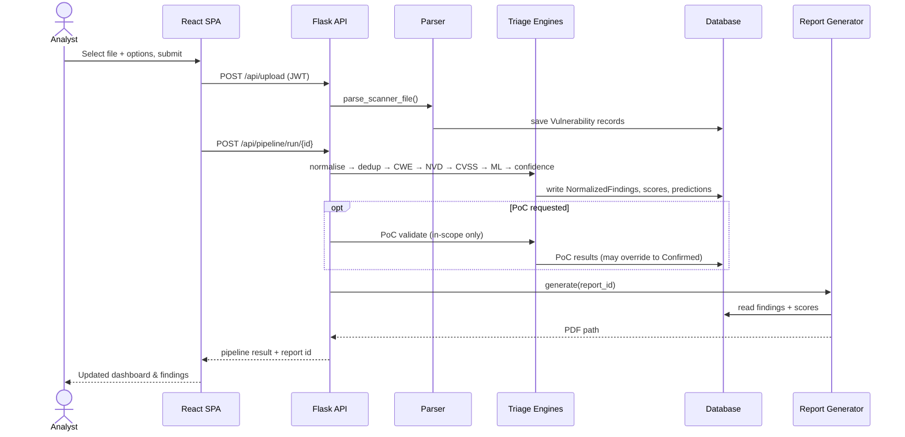
```mermaid
sequenceDiagram
    actor Analyst
    participant SPA as React SPA
    participant API as Flask API
    participant Parser
    participant Engines as Triage Engines
    participant DB as Database
    participant Report as Report Generator

    Analyst->>SPA: Select file + options, submit
    SPA->>API: POST /api/upload (JWT)
    API->>Parser: parse_scanner_file()
    Parser->>DB: save Vulnerability records
    SPA->>API: POST /api/pipeline/run/{id}
    API->>Engines: normalise → dedup → CWE → NVD → CVSS → ML → confidence
    Engines->>DB: write NormalizedFindings, scores, predictions
    opt PoC requested
        API->>Engines: PoC validate (in-scope only)
        Engines->>DB: PoC results (may override to Confirmed)
    end
    API->>Report: generate(report_id)
    Report->>DB: read findings + scores
    Report-->>API: PDF path
    API-->>SPA: pipeline result + report id
    SPA-->>Analyst: Updated dashboard & findings
```

**Figure 4.4: Sequence Diagram — Upload and Triage**

The diagram makes explicit the two-step nature of ingestion: the upload request first persists the raw findings, and a subsequent pipeline request runs the analytical engines. The optional PoC block is drawn as an `opt` fragment because it executes only when the analyst has requested validation and the target is in scope.

**(b) Auto Scan orchestration.** Figure 4.5 shows the optional orchestration workflow, in which the system itself drives the scanners before triaging their output.

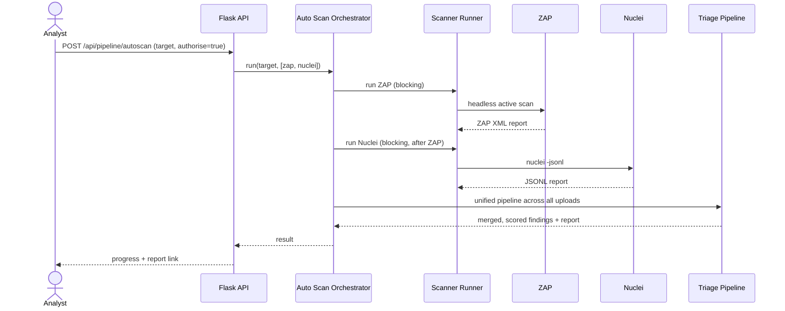
```mermaid
sequenceDiagram
    actor Analyst
    participant API as Flask API
    participant Orch as Auto Scan Orchestrator
    participant Runner as Scanner Runner
    participant ZAP
    participant Nuclei
    participant Pipe as Triage Pipeline

    Analyst->>API: POST /api/pipeline/autoscan (target, authorise=true)
    API->>Orch: run(target, [zap, nuclei])
    Orch->>Runner: run ZAP (blocking)
    Runner->>ZAP: headless active scan
    ZAP-->>Runner: ZAP XML report
    Orch->>Runner: run Nuclei (blocking, after ZAP)
    Runner->>Nuclei: nuclei -jsonl
    Nuclei-->>Runner: JSONL report
    Orch->>Pipe: unified pipeline across all uploads
    Pipe-->>Orch: merged, scored findings + report
    Orch-->>API: result
    API-->>Analyst: progress + report link
```

**Figure 4.5: Sequence Diagram — Auto Scan Orchestration**

A key design detail visible here is that the scanners are driven **sequentially, not concurrently**: the orchestrator runs ZAP to completion before starting Nuclei. This was a deliberate decision, because running a heavyweight active scan (ZAP, which additionally launches a headless browser for its AJAX spider) alongside a second scanner risks exhausting the host's memory. After both scanners finish, a **single unified pipeline** runs across all of their uploads at once, so that a finding reported by both scanners is merged into one record with a higher corroboration count.

### 4.2.6 Class Diagram

The static structure separates **persistent domain models** (SQLAlchemy entities that represent stored data) from **engine services** (stateless processors that transform that data). Figure 4.6 shows the principal classes; attributes and methods are abbreviated for readability.

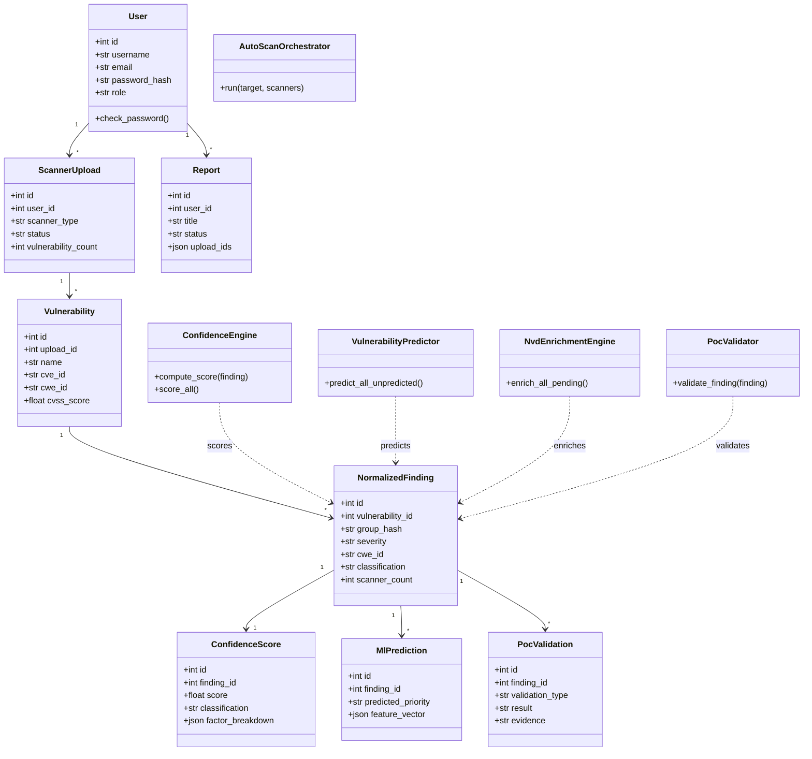
```mermaid
classDiagram
    class User {
        +int id
        +str username
        +str email
        +str password_hash
        +str role
        +check_password()
    }
    class ScannerUpload {
        +int id
        +int user_id
        +str scanner_type
        +str status
        +int vulnerability_count
    }
    class Vulnerability {
        +int id
        +int upload_id
        +str name
        +str cve_id
        +str cwe_id
        +float cvss_score
    }
    class NormalizedFinding {
        +int id
        +int vulnerability_id
        +str group_hash
        +str severity
        +str cwe_id
        +str classification
        +int scanner_count
    }
    class ConfidenceScore {
        +int id
        +int finding_id
        +float score
        +str classification
        +json factor_breakdown
    }
    class MlPrediction {
        +int id
        +int finding_id
        +str predicted_priority
        +json feature_vector
    }
    class PocValidation {
        +int id
        +int finding_id
        +str validation_type
        +str result
        +str evidence
    }
    class Report {
        +int id
        +int user_id
        +str title
        +str status
        +json upload_ids
    }

    class ConfidenceEngine {
        +compute_score(finding)
        +score_all()
    }
    class VulnerabilityPredictor {
        +predict_all_unpredicted()
    }
    class NvdEnrichmentEngine {
        +enrich_all_pending()
    }
    class PocValidator {
        +validate_finding(finding)
    }
    class AutoScanOrchestrator {
        +run(target, scanners)
    }

    User "1" --> "*" ScannerUpload
    User "1" --> "*" Report
    ScannerUpload "1" --> "*" Vulnerability
    Vulnerability "1" --> "*" NormalizedFinding
    NormalizedFinding "1" --> "1" ConfidenceScore
    NormalizedFinding "1" --> "*" MlPrediction
    NormalizedFinding "1" --> "*" PocValidation
    ConfidenceEngine ..> NormalizedFinding : scores
    VulnerabilityPredictor ..> NormalizedFinding : predicts
    NvdEnrichmentEngine ..> NormalizedFinding : enriches
    PocValidator ..> NormalizedFinding : validates
```

**Figure 4.6: Class Diagram**

The solid arrows denote *associations* (ownership relationships that are persisted as foreign keys), while the dashed arrows denote *dependencies* (an engine acting upon a model without owning it). This clean split — data classes that hold state and know nothing about processing, and engine classes that hold no state and act upon the data classes — is the object-oriented realisation of the single-responsibility principle from §4.2.1, and it is what allows each engine to be unit-tested against lightweight stand-in objects.

### 4.2.7 Data Flow Diagrams

The data flow is presented at two levels of abstraction. Figure 4.7 is the **Level 0 (context) diagram**, which treats the whole system as a single process and shows only its external interactions.


```mermaid
flowchart LR
    ANALYST([Security Analyst])
    SCAN([Scanner Reports /<br/>Live Targets])
    NVD([NVD Feeds])
    SYS(("VulnTriage<br/>System"))
    ANALYST -- "scan files, options,<br/>auth requests" --> SYS
    SCAN -- "native reports" --> SYS
    NVD -- "CVSS + CWE data" --> SYS
    SYS -- "triaged findings,<br/>confidence, PDF report" --> ANALYST
```

**Figure 4.7: Data Flow Diagram — Level 0 (Context)**

Figure 4.8 is the **Level 1 diagram**, which decomposes the system into its seven internal processes and the four data stores through which they communicate. The data stores correspond directly to groups of database tables (§4.3), which reinforces the pipeline design in which stages exchange data only through persistence.

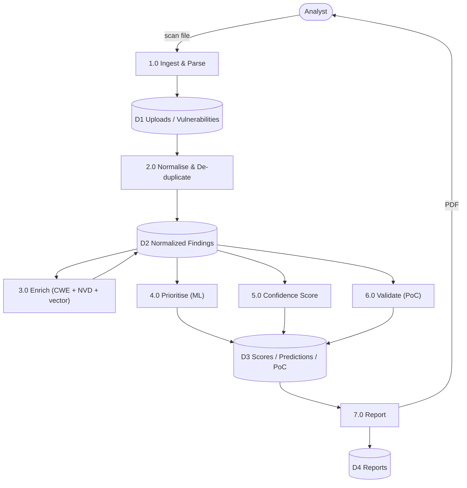
```mermaid
flowchart TB
    ANALYST([Analyst])
    P1["1.0 Ingest & Parse"]
    P2["2.0 Normalise & De-duplicate"]
    P3["3.0 Enrich (CWE + NVD + vector)"]
    P4["4.0 Prioritise (ML)"]
    P5["5.0 Confidence Score"]
    P6["6.0 Validate (PoC)"]
    P7["7.0 Report"]
    D1[("D1 Uploads / Vulnerabilities")]
    D2[("D2 Normalized Findings")]
    D3[("D3 Scores / Predictions / PoC")]
    D4[("D4 Reports")]

    ANALYST -->|scan file| P1 --> D1
    D1 --> P2 --> D2
    D2 --> P3 --> D2
    D2 --> P4 --> D3
    D2 --> P5 --> D3
    D2 --> P6 --> D3
    D3 --> P7 --> D4
    P7 -->|PDF| ANALYST
```

**Figure 4.8: Data Flow Diagram — Level 1**

---

## 4.3 Database Design

### 4.3.1 Design Approach

The persistent data is modelled as a **normalised relational schema** accessed through the SQLAlchemy Object-Relational Mapper. Two decisions shape the design. First, the schema is engine-portable: the models use only generic column types (including a generic `JSON` type rather than any PostgreSQL-specific type), so that the identical schema runs on **PostgreSQL** for the web deployment and on **SQLite** for the desktop and CLI deployments. Second, the schema deliberately preserves an **audit trail**: the raw findings exactly as the scanner reported them are retained in a `vulnerabilities` table, separate from the canonical `normalized_findings` that the pipeline operates on, so that it is always possible to trace a triaged finding back to the original scanner output. Figure 4.9 shows the entity-relationship diagram.

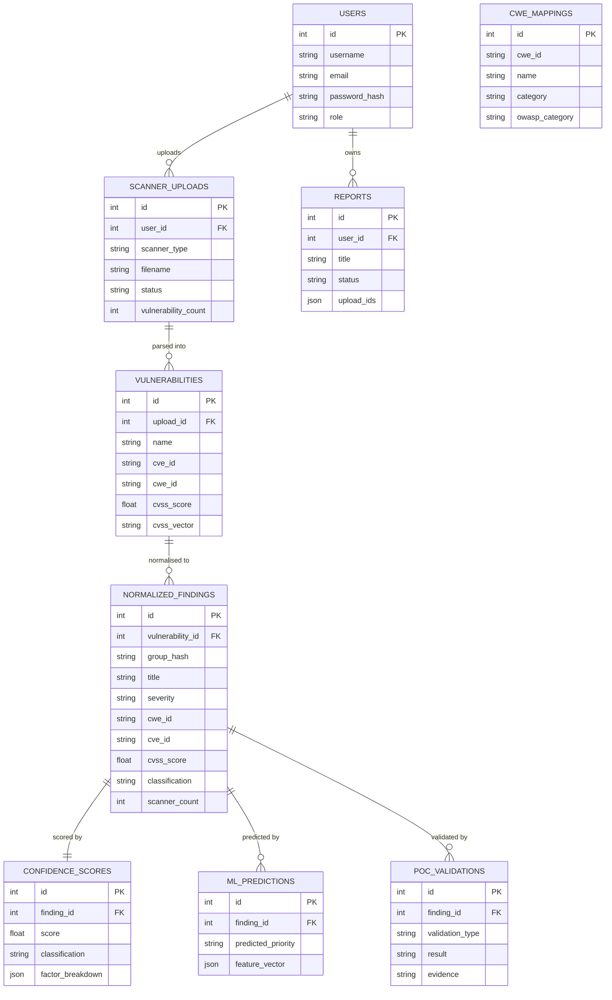
```mermaid
erDiagram
    USERS ||--o{ SCANNER_UPLOADS : uploads
    USERS ||--o{ REPORTS : owns
    SCANNER_UPLOADS ||--o{ VULNERABILITIES : "parsed into"
    VULNERABILITIES ||--o{ NORMALIZED_FINDINGS : "normalised to"
    NORMALIZED_FINDINGS ||--|| CONFIDENCE_SCORES : "scored by"
    NORMALIZED_FINDINGS ||--o{ ML_PREDICTIONS : "predicted by"
    NORMALIZED_FINDINGS ||--o{ POC_VALIDATIONS : "validated by"

    USERS {
        int id PK
        string username
        string email
        string password_hash
        string role
    }
    SCANNER_UPLOADS {
        int id PK
        int user_id FK
        string scanner_type
        string filename
        string status
        int vulnerability_count
    }
    VULNERABILITIES {
        int id PK
        int upload_id FK
        string name
        string cve_id
        string cwe_id
        float cvss_score
        string cvss_vector
    }
    NORMALIZED_FINDINGS {
        int id PK
        int vulnerability_id FK
        string group_hash
        string title
        string severity
        string cwe_id
        string cve_id
        float cvss_score
        string classification
        int scanner_count
    }
    CONFIDENCE_SCORES {
        int id PK
        int finding_id FK
        float score
        string classification
        json factor_breakdown
    }
    ML_PREDICTIONS {
        int id PK
        int finding_id FK
        string predicted_priority
        json feature_vector
    }
    POC_VALIDATIONS {
        int id PK
        int finding_id FK
        string validation_type
        string result
        string evidence
    }
    REPORTS {
        int id PK
        int user_id FK
        string title
        string status
        json upload_ids
    }
    CWE_MAPPINGS {
        int id PK
        string cwe_id
        string name
        string category
        string owasp_category
    }
```

**Figure 4.9: Entity-Relationship Diagram**

### 4.3.2 Table Descriptions

| Table | Purpose and notable fields |
|-------|----------------------------|
| `users` | Registered analysts. Stores a hashed password (never plaintext) and a role. Owns uploads and reports via one-to-many relationships. |
| `scanner_uploads` | One row per submitted scan file (or per scanner within an Auto Scan run). Tracks the `scanner_type`, the processing `status`, and the resulting `vulnerability_count`. |
| `vulnerabilities` | The raw findings exactly as parsed from a scanner report, before normalisation. This table is the audit trail that links every triaged result back to its source. |
| `normalized_findings` | The canonical, de-duplicated findings on which the whole pipeline operates. The `group_hash` (a SHA-256 digest) is the key used to merge duplicates; `scanner_count` records how many scanners corroborated the finding; and `classification` holds the final verdict. |
| `confidence_scores` | One score (0–100) per finding, together with the six per-factor sub-scores and a JSON `factor_breakdown` that stores the full explanation used for the rationale. |
| `ml_predictions` | The Random Forest's predicted severity band and the exact `feature_vector` used to produce it, retained for traceability and debugging. |
| `poc_validations` | The results of non-destructive proof-of-concept checks — the `validation_type`, the `result` (confirmed / not confirmed / skipped / error), and the `evidence`. A confirmed result overrides the classification. |
| `reports` | Generated PDF reports. The `upload_ids` field (a JSON array) records which uploads a report covers. |
| `cwe_mappings` | A reference table of CWE identifiers with names and OWASP categories, used for display and for seeding. |

### 4.3.3 Relationships and Normalisation

The schema is in third normal form. The relationship chain `users → scanner_uploads → vulnerabilities → normalized_findings` models the natural ownership hierarchy from an analyst down to an individual finding. The three analytical tables (`confidence_scores`, `ml_predictions`, `poc_validations`) attach to `normalized_findings` rather than to the raw `vulnerabilities`, because analysis is performed on the canonical findings. The `cwe_mappings` table is an independent reference table with no foreign key, since it describes weakness classes in the abstract rather than any particular finding. The one intentional denormalisation is `reports.upload_ids`, which stores a set of upload identifiers as a JSON array rather than in a separate join table; this was chosen because a report may span an arbitrary set of uploads and is only ever read as a whole, so a join table would add complexity without benefit.

---

## 4.4 Interface Design

### 4.4.1 Design Philosophy

The web interface is a single-page application whose visual language is a **dashboard with a persistent dark navigation sidebar and a light content area**, implemented with Tailwind CSS. The design prioritises the rapid scanning of tabular security data: severity and classification are always encoded with **consistent colour semantics** (red for critical/high, amber for medium, green for low/confirmed, grey for informational), so that an analyst can absorb the state of a scan at a glance. Every authenticated screen shares a common layout — the sidebar for navigation and a header showing the current user and a logout control — so that navigation is predictable and the analyst is never disoriented.

### 4.4.2 Navigation Structure

Figure 4.10 shows the navigation map. Access control is enforced by a client-side route guard: unauthenticated users are redirected to the login screen, and all data screens sit behind that guard.

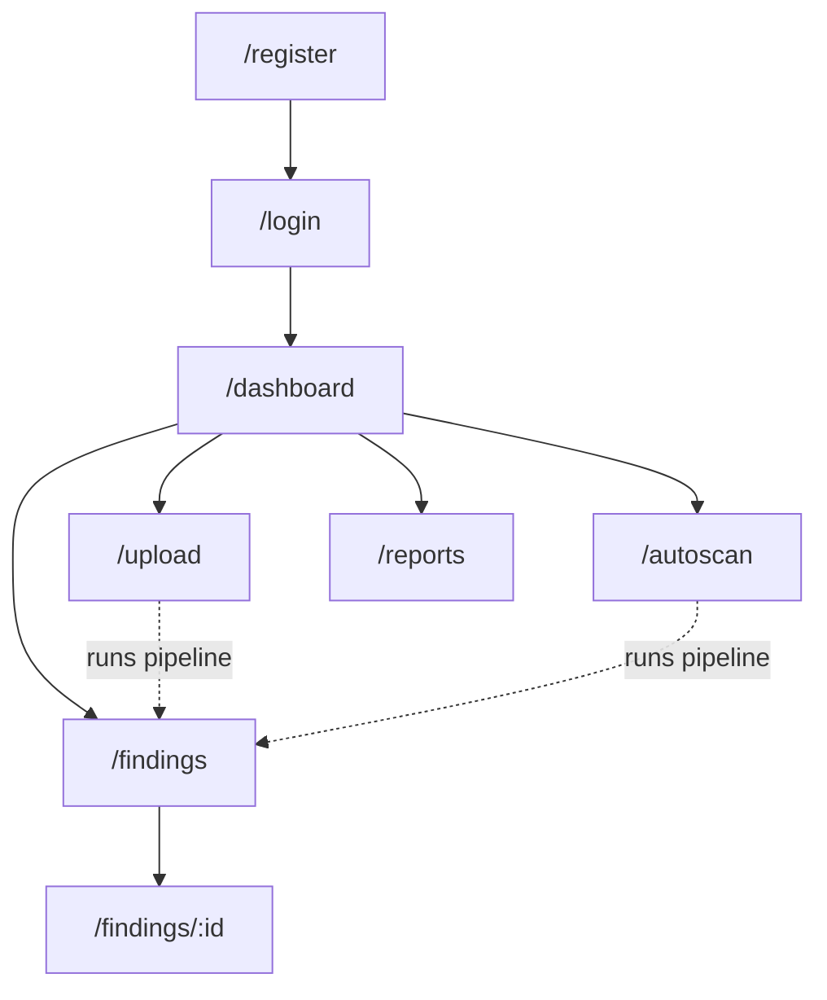
```mermaid
flowchart TD
    LOGIN["/login"] --> DASH["/dashboard"]
    REG["/register"] --> LOGIN
    DASH --> UPL["/upload"]
    DASH --> AUTO["/autoscan"]
    DASH --> FIND["/findings"]
    DASH --> REP["/reports"]
    FIND --> DETAIL["/findings/:id"]
    UPL -. "runs pipeline" .-> FIND
    AUTO -. "runs pipeline" .-> FIND
```

**Figure 4.10: Navigation Structure**

### 4.4.3 Screen Design

Each principal screen is described below with reference to its screenshot. (The screenshots are collected, with justifications, in §4.6; here they are discussed from the standpoint of interface design.)

**Authentication.** The login and registration screens (Figures 4.18 and 4.19) present a single focused form. Their minimalism reflects the design goal of moving the analyst into the workspace with the least friction; all other functionality is gated behind successful authentication.

**Dashboard.** The dashboard (Figure 4.20) is the landing screen and the clearest expression of the system's value. It is organised top-to-bottom in decreasing order of abstraction: four key-performance-indicator cards give the headline counts (Total Findings, Confirmed, Needs Review, Total Uploads); three charts characterise the dataset (a severity-breakdown pie, a classification-results pie, and a scans-by-tool bar chart); and a Top-10-by-CVSS table lets the analyst drill straight into the most severe findings. This layout embodies the "overview first, detail on demand" principle of information-dashboard design.

**Upload.** The upload screen (Figure 4.21) is the primary ingestion path. It is divided into three regions: a scanner-type selector and drag-and-drop file zone; a *Pipeline Options* region exposing the Exploit-Lookup and PoC-Validation toggles, each annotated with a plain-language description of what it does and its safety implications; and an upload-history table with a per-row action to run the pipeline. Surfacing the two optional, potentially intrusive capabilities as clearly-labelled toggles — rather than hiding them in configuration — is a deliberate usability and safety decision.

**Auto Scan.** The Auto Scan screen (Figure 4.22) provides a target field, scanner check-boxes, and, crucially, an explicit authorisation acknowledgement that must be ticked before a scan can start. This gate is the interface-level expression of the responsible-operation principle.

**Findings.** The findings screen (Figure 4.23) is the analyst's primary working list: a filterable, sortable table of all normalised findings, with columns for severity, CVSS, classification, scanner, and CWE. The classification badge in each row lets the analyst immediately focus on *Confirmed* items and ignore auto-dismissed noise — the practical payoff of the whole system.

**Finding detail.** The finding-detail screen (Figure 4.24) is the deepest and most important screen. It presents, in a single scroll, the finding's identity and metadata, its classification (with an override control), the **confidence score and its full six-factor breakdown** (discussed in detail in §4.5.4), the machine-learning priority prediction, the CVSS v3 metrics, the description and recommended solution, and the proof-of-concept evidence. This screen is where the system's commitment to explainability becomes concrete.

### 4.4.4 Storyboard

Figure 4.11 summarises the intended user journey through the interface, from authentication to the final report.

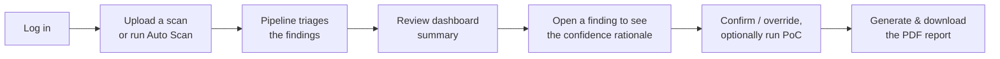
```mermaid
flowchart LR
    A["Log in"] --> B["Upload a scan<br/>or run Auto Scan"]
    B --> C["Pipeline triages<br/>the findings"]
    C --> D["Review dashboard<br/>summary"]
    D --> E["Open a finding to see<br/>the confidence rationale"]
    E --> F["Confirm / override,<br/>optionally run PoC"]
    F --> G["Generate & download<br/>the PDF report"]
```

**Figure 4.11: Storyboard — User Journey**

---

## 4.5 Execution

### 4.5.1 Deployment Modes

From a single codebase, VulnTriage runs in three modes so that it suits both interactive analysis and automation. Figure 4.12 shows how the three modes share the engine pipeline and the model while differing in their front end and database.

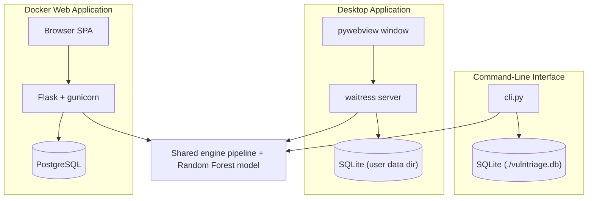
```mermaid
flowchart TB
    subgraph M1["Desktop Application"]
        D1["pywebview window"] --> D2["waitress server"]
        D2 --> D3[("SQLite (user data dir)")]
    end
    subgraph M2["Docker Web Application"]
        W1["Browser SPA"] --> W2["Flask + gunicorn"]
        W2 --> W3[("PostgreSQL")]
    end
    subgraph M3["Command-Line Interface"]
        C1["cli.py"] --> C2[("SQLite (./vulntriage.db)")]
    end
    CORE["Shared engine pipeline + Random Forest model"]
    D2 --> CORE
    W2 --> CORE
    C1 --> CORE
```

**Figure 4.12: Deployment Diagram — Three Run Modes**

1. **Desktop application.** A native window built with pywebview serves the compiled front end through an embedded waitress server, backed by a SQLite database in the user's data directory. This mode targets a single analyst working on a workstation and requires no infrastructure; it launches from the operating-system menu and logs in with default credentials.

2. **Dockerised web application.** A `docker compose up` command builds and serves the front end and the API together on `localhost:5000`, backed by PostgreSQL. This mode targets a shared or team deployment and pins the container to a Python version for which all machine-learning dependencies have pre-built wheels.

3. **Command-line interface.** The `cli.py` entry point offers `scan` and `autoscan` sub-commands that run the identical pipeline headlessly and default to a local SQLite database. This mode targets scripting, automation, and continuous-integration use.

Because all three modes invoke the same engine services, their triage results are identical regardless of how the system is invoked — a direct benefit of the single-responsibility engine design.

### 4.5.2 Pipeline Execution

When a report is ingested — whether by upload, by the CLI, or by an Auto Scan — the engines execute in a fixed order, each reading and writing through the ORM:

```
normalisation → deduplication → cwe_mapper → nvd_enrichment
  → cwe_cvss_enrichment → ml/predictor → confidence_engine
  → (optional) poc_validator → report_generator
```

The ordering is not arbitrary; each stage depends on the outputs of the previous ones.

- **Normalisation** unifies severities, CWE identifiers, and field names into a common shape. It also cleans the data at this single chokepoint: it drops non-informative CWE placeholders (such as `CWE-0`, which some scanners emit to mean "no weakness assigned") so that they do not block later mapping, and it strips HTML markup from scanner descriptions so that the interface and report display readable text.
- **De-duplication** computes a SHA-256 `group_hash` over a finding's identifying attributes and merges duplicates. When the same issue is reported by two different scanners, the merge raises the `scanner_count`, which the Confidence Engine later reads as cross-tool corroboration.
- **CWE mapping** must run before enrichment so that a weakness class is available for the vector-inference step; it fills a CWE from a curated keyword table (fifty-eight patterns) when the scanner supplied none.
- **NVD enrichment** streams the offline NVD feeds to fill an authoritative CVSS vector and to back-fill a CWE for any finding that carries a CVE but no weakness class.
- **CWE→CVSS enrichment** must run after CWE mapping and NVD enrichment, because it only acts on findings that still lack a vector; it derives a plausible CVSS vector from the CWE so that the ML model receives real features rather than an all-zero vector (which had previously caused it to predict "Low" for every web finding).
- **ML prioritisation** applies the Random Forest to predict a severity band from the CVSS sub-metrics and the CWE.
- **Confidence scoring** combines six reliability factors into a 0–100 score and a classification (§4.5.4).
- **PoC validation**, when requested, runs non-destructive checks against in-scope targets; a confirmed result overrides the classification to *Confirmed*.
- **Report generation** renders the PDF triage report.

### 4.5.3 The Machine-Learning Component

The prioritiser is a **Random Forest implemented in pure NumPy**, so that inference at run time requires only NumPy and not the heavier scikit-learn stack (which is used only during training). It is trained on **108,495** real CVSS-v3 records drawn from the National Vulnerability Database JSON feeds for 2023–2025. Crucially, the model predicts the severity band from the **eight CVSS sub-metrics and the CWE only, deliberately excluding the CVSS base score**. This exclusion prevents *target leakage*: because the severity band is itself derived from the base score, including the score as an input would let the model trivially reproduce the answer and report a meaningless near-perfect accuracy. On a held-out set of 21,697 real records the model achieves an **accuracy of 0.9968 and a macro-averaged F1 of 0.9941**, with all misclassifications falling on adjacent severity bands rather than being gross errors.

An honest limitation is stated for completeness: the CVSS base score is a deterministic function of its sub-metrics, so this task is close to deterministic and the model is effectively relearning the CVSS scoring formula. The high accuracy is therefore legitimate (there is no leakage) but reflects the near-deterministic nature of the task. The genuinely novel analytical contribution of the project is not this prioritiser but the Confidence Engine described next, which predicts something CVSS cannot express — the probability that a finding is a true positive.

Table 4.1 lists the tools and libraries used to build and run the model.

| Index | Tool / Library | Purpose |
|-------|----------------|---------|
| 1 | NumPy | Numerical arrays for the pure-Python Random Forest; the only dependency required at inference time. |
| 2 | scikit-learn | Used during training only, for the stratified train/test split and evaluation utilities. |
| 3 | ijson | Streams the compressed NVD JSON feeds with constant memory during training and enrichment. |
| 4 | NVD JSON 2.0 feeds | The 108,495-record real-world training corpus (CVSS-v3 vectors + CWE, for 2023–2025). |

**Table 4.1: Machine-Learning Component — Tools and Libraries**

**Feature definition and the anti-leakage decision.** The single most important design decision in the model concerns *which inputs it is permitted to see*. Figure 4.13 shows the feature definition in `predictor.py`. The model is given the eight CVSS v3 sub-metrics (attack vector, attack complexity, privileges required, user interaction, scope, and the three impact metrics) together with the numeric CWE identifier — nine features in total — but it is deliberately *not* given the CVSS base score. The inline comment records the reason: because the training label (the severity band) is itself derived from the base score, feeding the score back in as an input would constitute *target leakage* and would let the model trivially reproduce the label, yielding a meaningless near-perfect accuracy. Excluding it forces the model to learn the relationship between the underlying vector components and the severity band, which is the genuine learning task.

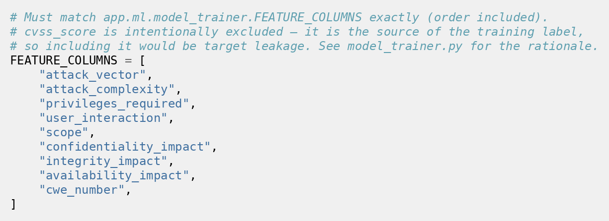

**Figure 4.13: Feature Definition (predictor.py) — the CVSS base score is deliberately excluded to prevent target leakage**

**Feature extraction and inference.** Figure 4.14 shows how a stored finding is converted into a feature vector and classified. The `_build_feature_vector` method encodes each categorical CVSS sub-metric into an integer using a fixed mapping and extracts the numeric part of the CWE identifier; if the structured CWE is missing, it falls back to a keyword lookup on the finding's title and description, so that even a bare web finding yields usable features rather than an all-zero vector. The `predict_finding` method then loads the serialised model once, wraps the feature vector in a NumPy array, and calls the forest's `predict` and `predict_proba` methods to obtain both the predicted severity band and the per-class probabilities. The probabilities are persisted alongside the prediction so that the interface can display the model's confidence in each band, as seen in the "ML Priority Prediction" panel of the finding-detail screen (Figure 4.24).

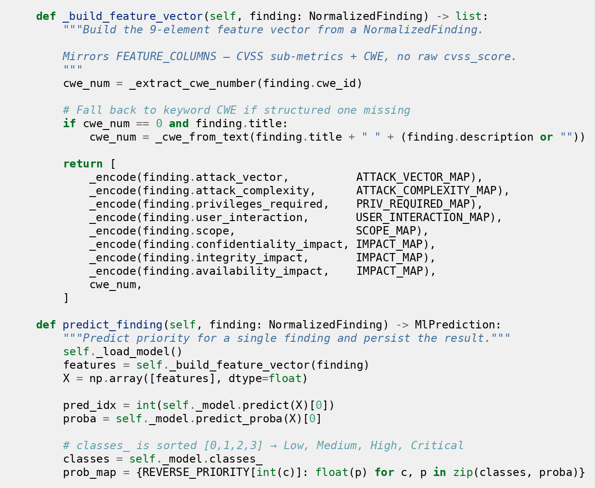

**Figure 4.14: Feature Extraction and Prediction (predictor.py)**

### 4.5.4 Confidence Scoring in Detail

The Confidence Engine is the system's central innovation. It answers a different question from severity: **how likely is it that this finding is a genuine, actionable vulnerability rather than noise?** It computes a weighted score from six *reliability* factors, whose weights sum to 100. Table 4.2 lists the factors, their weights, and what each measures.

| Factor | Weight | What it measures |
|--------|:------:|------------------|
| Scanner agreement | 25 | Independent corroboration — how many separate tools flagged the same issue. |
| Severity consistency | 20 | Whether the ML-predicted severity agrees with the scanner's reported severity. |
| CVE availability | 15 | Whether the finding maps to a catalogued CVE. |
| Exploit availability | 15 | Whether a public exploit exists for the issue (via Exploit-DB). |
| PoC validation | 15 | Whether an active, non-destructive check confirmed the issue. |
| CWE mapping | 10 | Whether the finding has a recognised weakness class. |

**Table 4.2: Confidence Engine — Factors and Weights**

The resulting 0–100 score is classified as **Confirmed (≥70)**, **Needs Manual Verification (40–69)**, or **Not Confirmed (<40)**; independently, a confirmed proof-of-concept check overrides the classification to *Confirmed*.

**The scoring computation.** Figure 4.15 shows the core of the scoring method. Each factor returns a raw score in the range 0–100; the total is the weighted sum of those raw scores (each divided by 100 and multiplied by its weight), capped to the 0–100 range. Two overrides then apply. First, if any *strong, vulnerability-specific* proof-of-concept check confirmed the finding, the classification is forced to *Confirmed* and the score is rescaled into the 70–100 band — but note the deliberate restriction to strong, type-matched check types, so that a generic input reflection or a server-banner match cannot spuriously confirm a finding. Second, a scanner-rated *informational* finding is bucketed as "Informational" rather than being given a true-or-false verdict, because such findings (technology or version detection) are not vulnerabilities to confirm or deny. Otherwise the numeric score is mapped to a classification by the threshold function.

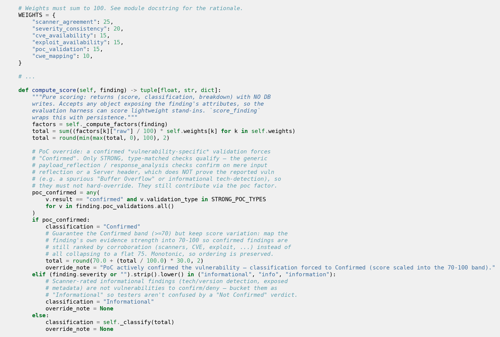

**Figure 4.15: Confidence Scoring — Weights, Weighted Sum, and Overrides (confidence_engine.py)**

**How individual factors are computed.** Figure 4.16 shows two representative factor methods together with the classification-threshold function. The scanner-agreement factor scales with the number of corroborating scanners — a single scanner scores partially, whereas two or more score highly — and it returns a human-readable *reason* string that becomes part of the finding's rationale. The CVE-availability factor is binary on the presence of a catalogued CVE. The `_classify` function applies the fixed thresholds — 70 and 40 — that separate *Confirmed*, *Needs Manual Verification*, and *Not Confirmed*. Because every factor returns both a raw score and a reason, the final verdict is fully explainable rather than a black-box number.

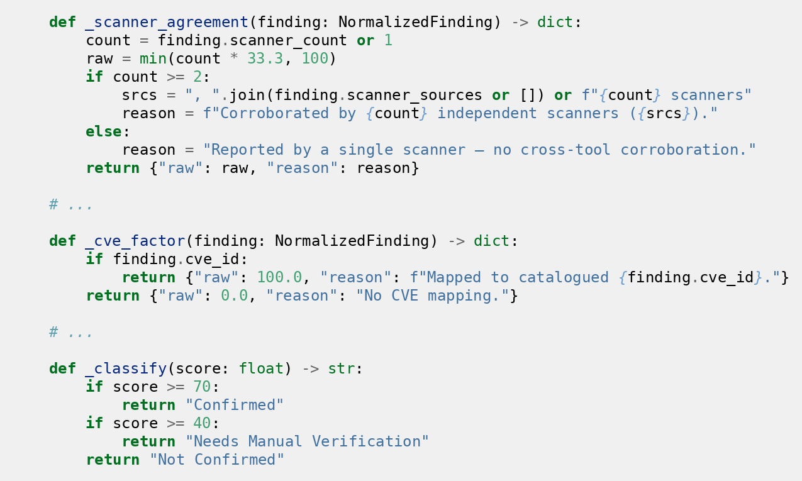

**Figure 4.16: Example Factor Computations and Classification Thresholds (confidence_engine.py)**

**A worked example.** Figure 4.17 shows the confidence panel from the interface for a confirmed SQL-injection finding, which makes the computation concrete.

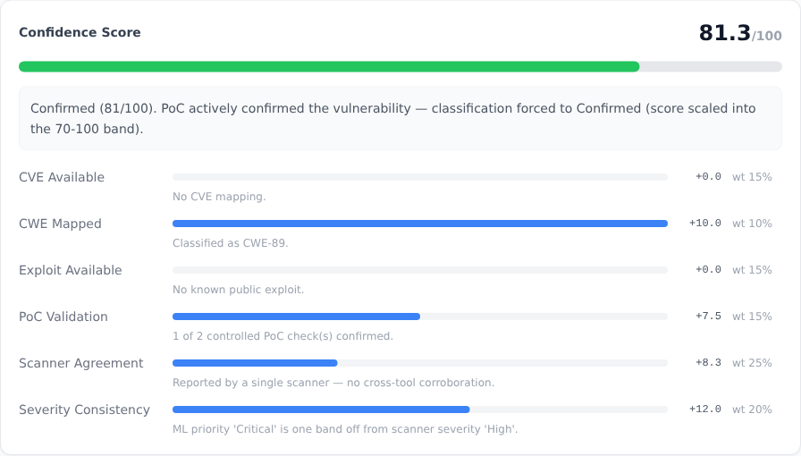

**Figure 4.17: Confidence-Score Breakdown (Finding Detail)**

Reading the panel, the finding scores **81.3/100** and is classified *Confirmed*. The rationale line explains that a proof-of-concept check actively confirmed the vulnerability, which forced the *Confirmed* classification and scaled the score into the 70–100 band. Below the rationale, each of the six factors is shown with its individual contribution and weight: the CWE-mapping factor contributes its full amount because the finding is classified as CWE-89; the PoC-validation factor contributes because one of the controlled checks confirmed; the scanner-agreement factor contributes a partial amount because only one scanner reported the issue; and the severity-consistency factor contributes because the machine-learning priority is close to the scanner's severity. The CVE- and exploit-availability factors contribute nothing here, because this web finding carries no CVE and no known public exploit. This per-factor transparency is exactly what allows an analyst to trust — or challenge — the automated verdict, and the same breakdown is embedded in the PDF report.

On its curated evaluation benchmark, the Confidence Engine achieves a ROC-AUC of approximately 0.82, a precision of 1.0 for the *Confirmed* classification (it never wrongly confirmed a false positive in the benchmark), and roughly 81% suppression of false positives at the auto-dismiss threshold.

### 4.5.5 Report Generation

The final stage renders a professional PDF triage report suitable for handing to stakeholders. The report opens with a cover page carrying the report metadata and a severity summary (Figure 4.26), followed by an executive summary that narrates the scan and tabulates the classification and severity breakdowns (Figure 4.27), and then the per-finding detail including the confidence rationale. Because the report reads from the same normalised findings and confidence scores as the interface, the two views are always consistent.

---

## 4.6 Screenshot

This section presents annotated screenshots of the completed product with a justification for each. The screenshots were captured from the running web application driven against a triaged dataset produced by an Auto Scan of a local test target (OWASP Juice Shop), yielding sixteen findings of which four are *Confirmed*.

### 4.6.1 Login


**Figure 4.18: Login Screen.** *Justification.* The entry point demonstrates the JWT-secured authentication gate. All data routes are protected, and unauthenticated access redirects here. The focused, minimal form reflects the design priority of getting an analyst into the workspace quickly.

### 4.6.2 Registration

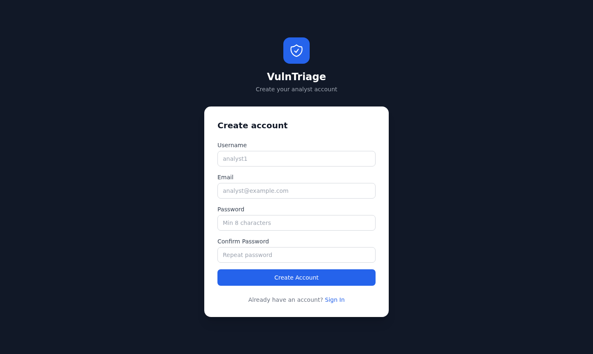

**Figure 4.19: Registration Screen.** *Justification.* New analysts self-register; the API hashes the password and issues a token on success. It documents the complete account-creation path (UC1).

### 4.6.3 Dashboard

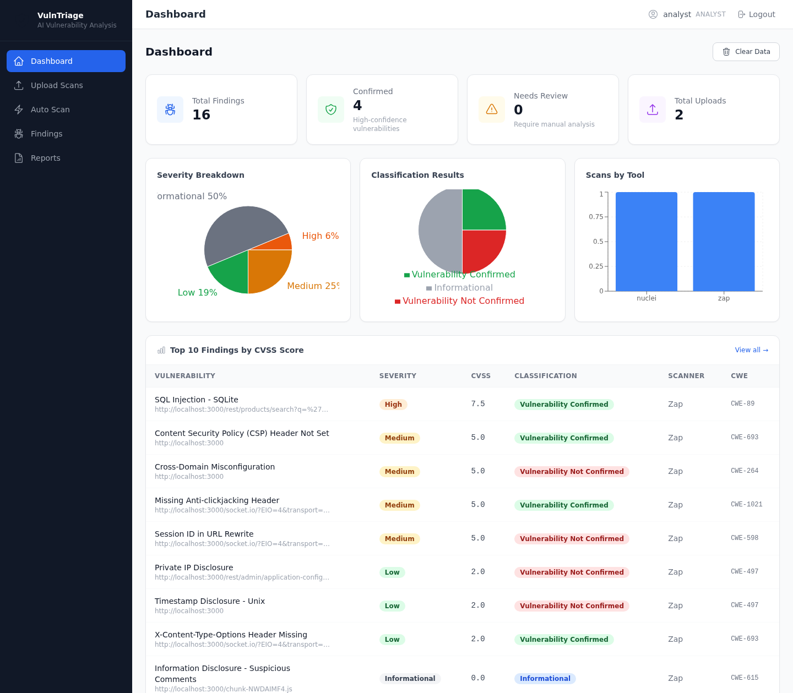

**Figure 4.20: Dashboard.** *Justification.* This is the analyst's landing view and the clearest demonstration of the system's value. The key-performance-indicator cards quantify the workload (sixteen findings, of which only four are *Confirmed* and none need review — the remainder auto-dismissed); the three charts characterise the dataset; and the Top-10 table surfaces the highest-CVSS findings with their classification and CWE. Together they show the triage system converting raw scanner noise into a prioritised, actionable shortlist.

### 4.6.4 Upload Scans

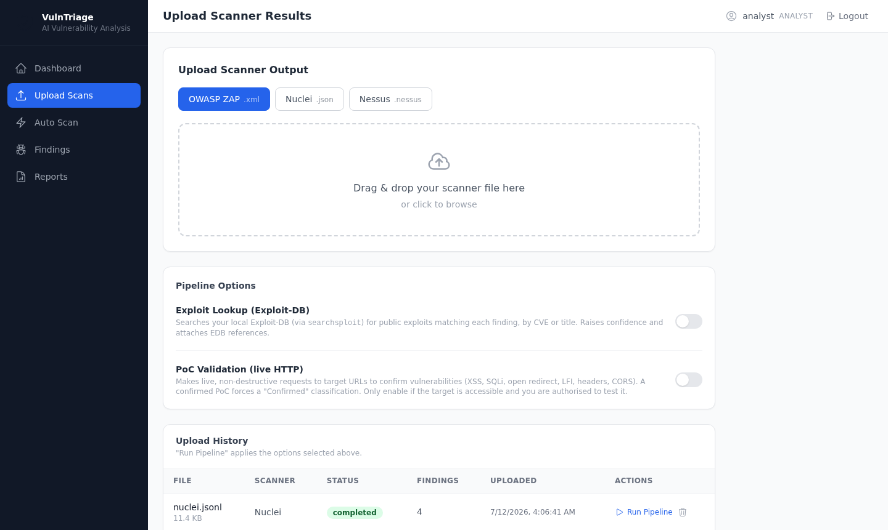

**Figure 4.21: Upload Screen.** *Justification.* This is the primary ingestion path (UC2). It shows the scanner-type selector, the drag-and-drop zone, the two clearly-labelled Pipeline Options (Exploit Lookup and PoC Validation) with their safety notes, and the upload-history table with a per-row *Run Pipeline* action.

### 4.6.5 Auto Scan

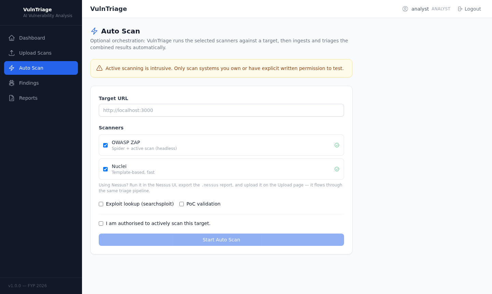

**Figure 4.22: Auto Scan Screen.** *Justification.* This shows the optional orchestration layer (UC3): a target field, scanner selection, and the explicit authorisation acknowledgement that gates all active scanning. The screen embodies the responsible-use design constraint that intrusive scanning must be deliberately opted into.

### 4.6.6 Findings

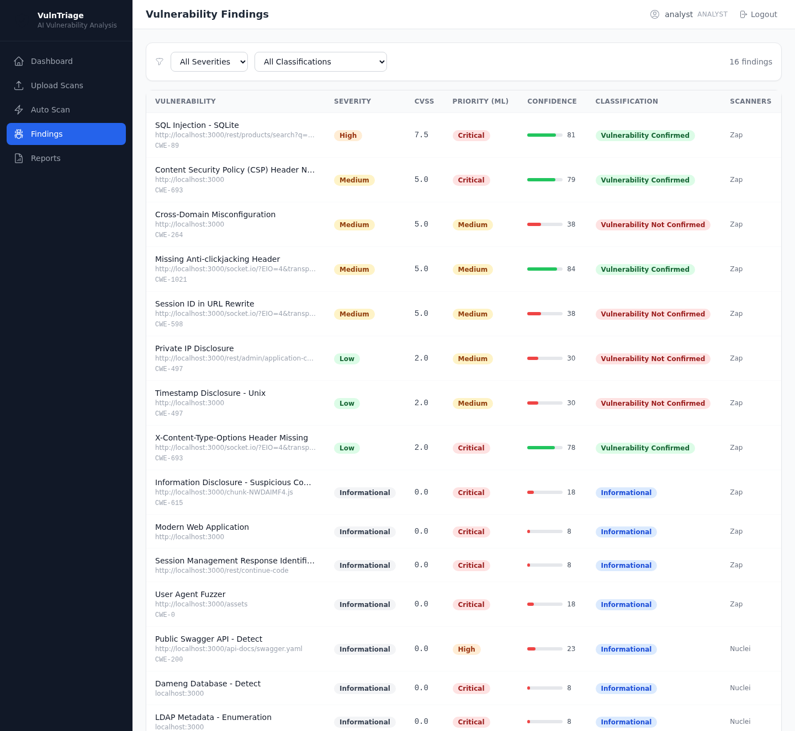

**Figure 4.23: Findings List.** *Justification.* The working list (UC5), where an analyst filters and sorts the full set of normalised findings. Each row's classification badge lets the analyst focus immediately on *Confirmed* items, demonstrating the practical false-positive reduction the project set out to achieve.

### 4.6.7 Finding Detail

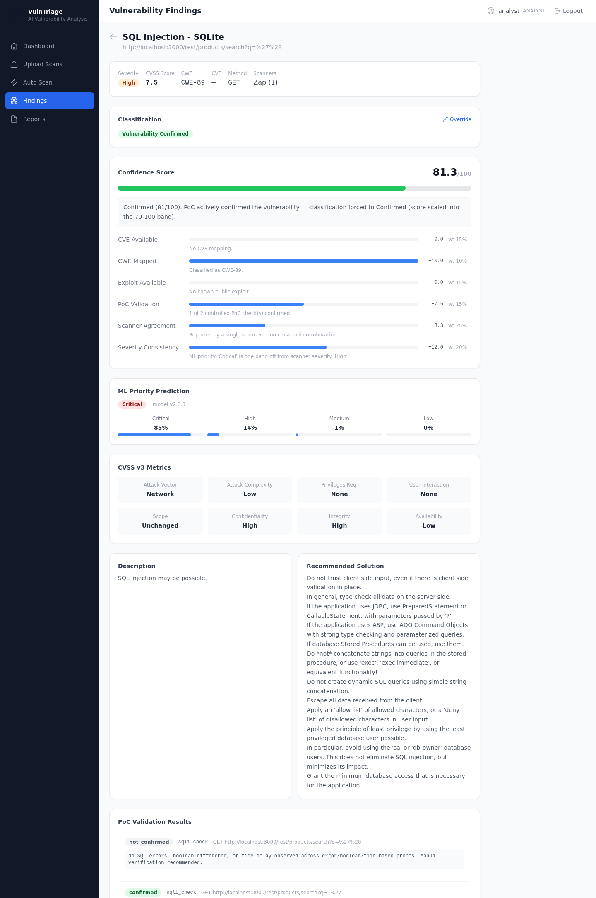

**Figure 4.24: Finding Detail.** *Justification.* The most important screen for the project's thesis. For the confirmed SQL-injection finding it shows the confidence score with its full six-factor breakdown, the machine-learning priority prediction, the CVSS v3 metrics, the description and recommended solution, and the proof-of-concept evidence that triggered the confirmation. This is the concrete realisation of explainable, evidence-backed triage. (The confidence panel is examined in isolation in Figure 4.17.)

### 4.6.8 Reports List

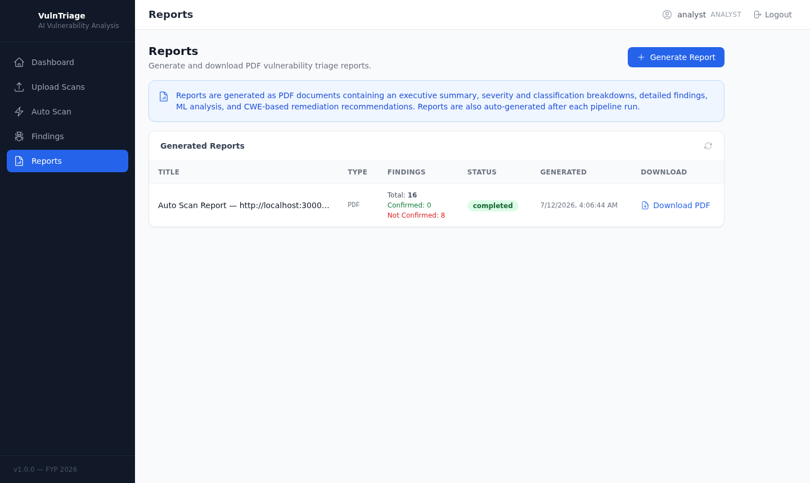

**Figure 4.25: Reports List.** *Justification.* Completes the workflow (UC9): generated PDF reports are listed and downloadable, providing the deliverable an analyst hands to stakeholders.

### 4.6.9 Generated PDF Report

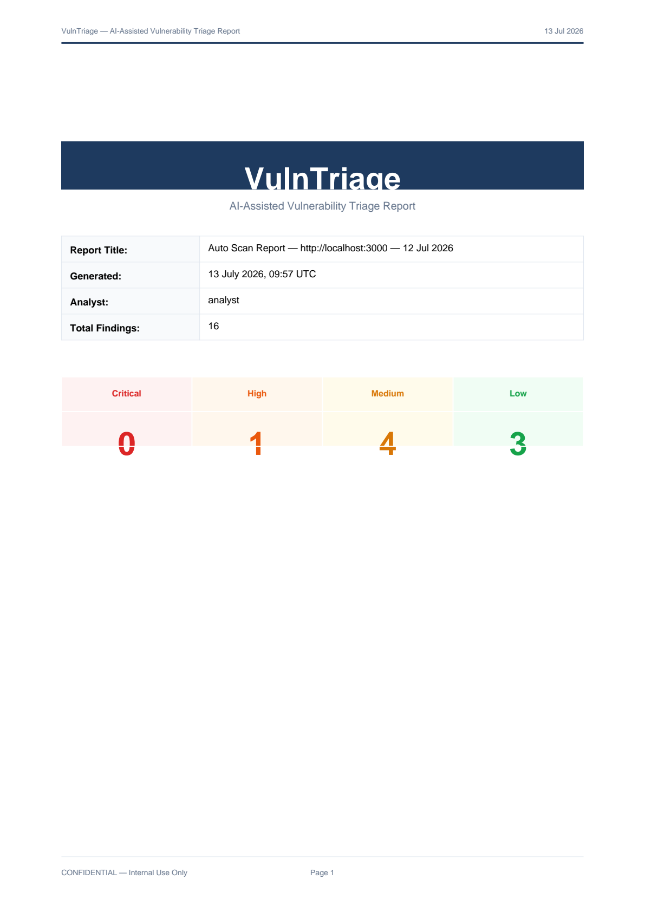

**Figure 4.26: PDF Report — Cover and Severity Summary.** *Justification.* The report's cover page carries the report metadata (title, generation time, analyst, total findings) and an at-a-glance severity summary. It demonstrates that the system's output is a polished, stakeholder-ready document, not merely an on-screen view.

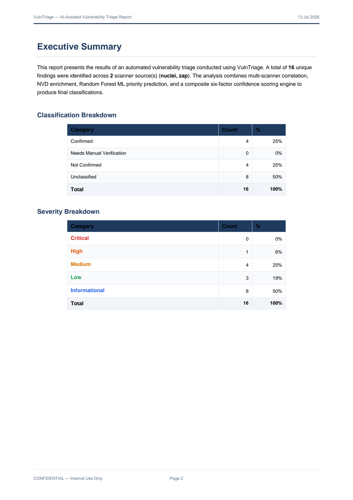

**Figure 4.27: PDF Report — Executive Summary.** *Justification.* The executive-summary page narrates the scan and tabulates the classification breakdown (four *Confirmed*, four *Not Confirmed*, eight informational/unclassified) and the severity breakdown. It shows that the triage verdicts and analytics presented in the interface are carried faithfully into the exported report.

---

## 4.7 Summary

This chapter presented the design and the completed implementation of VulnTriage using an object-oriented methodology. Section 4.2 set out the five design principles that govern the system and then modelled it with a layered system-architecture diagram, a use case diagram, an activity diagram of the triage pipeline, two sequence diagrams for the principal workflows, a class diagram separating domain models from engine services, and a two-level data flow diagram. Section 4.3 documented the nine-table relational schema as an entity-relationship diagram, described each table, and justified the normalisation and the single deliberate denormalisation. Section 4.4 described the interface-design philosophy, the navigation structure, each principal screen, and the user-journey storyboard. Section 4.5 explained how the system executes across its three deployment modes, detailed the ordered engine pipeline, and examined the two most important pieces of the implementation at the source-code level — the machine-learning component (with its anti-leakage feature design and its inference code) and the Confidence Engine (with its weighted-scoring code, its factor computations, and a worked example from the interface). Section 4.6 presented eleven annotated screenshots of the finished product — including the exported PDF report — with a justification for each. In total the chapter contains twelve diagrams, four annotated code figures, eleven application screenshots, and two component tables.

Taken together, these artefacts describe a fully realised system that ingests multi-scanner output and, through a normalisation–enrichment–prioritisation–confidence pipeline, produces explainable, prioritised, and confirmation-backed vulnerability findings. The following chapter evaluates the system's performance and effectiveness against the objectives established for the project.
