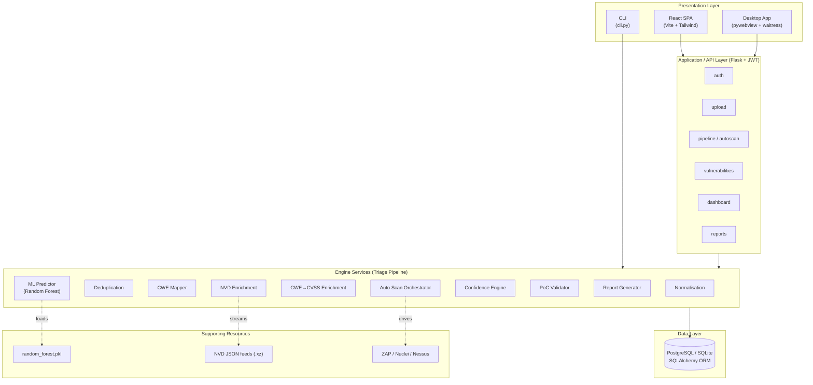
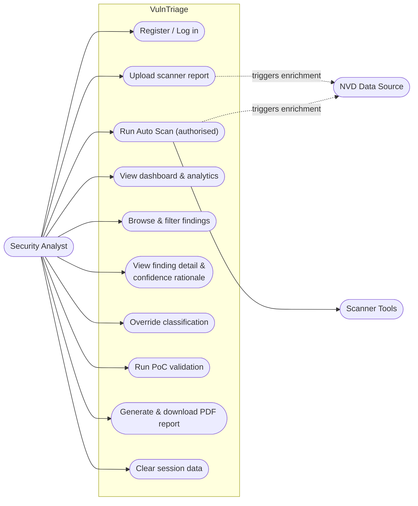
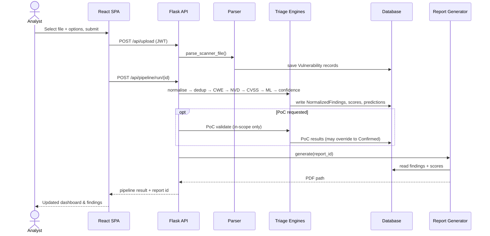
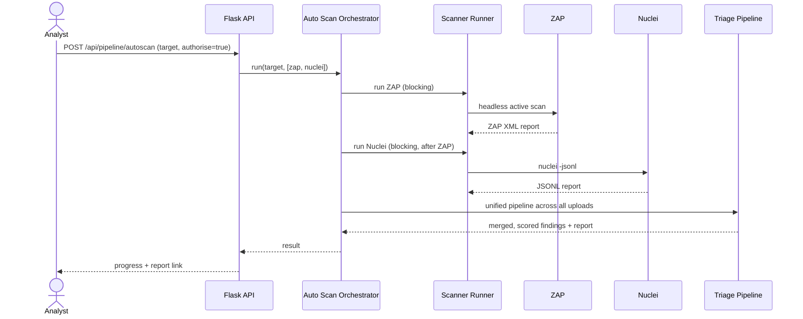
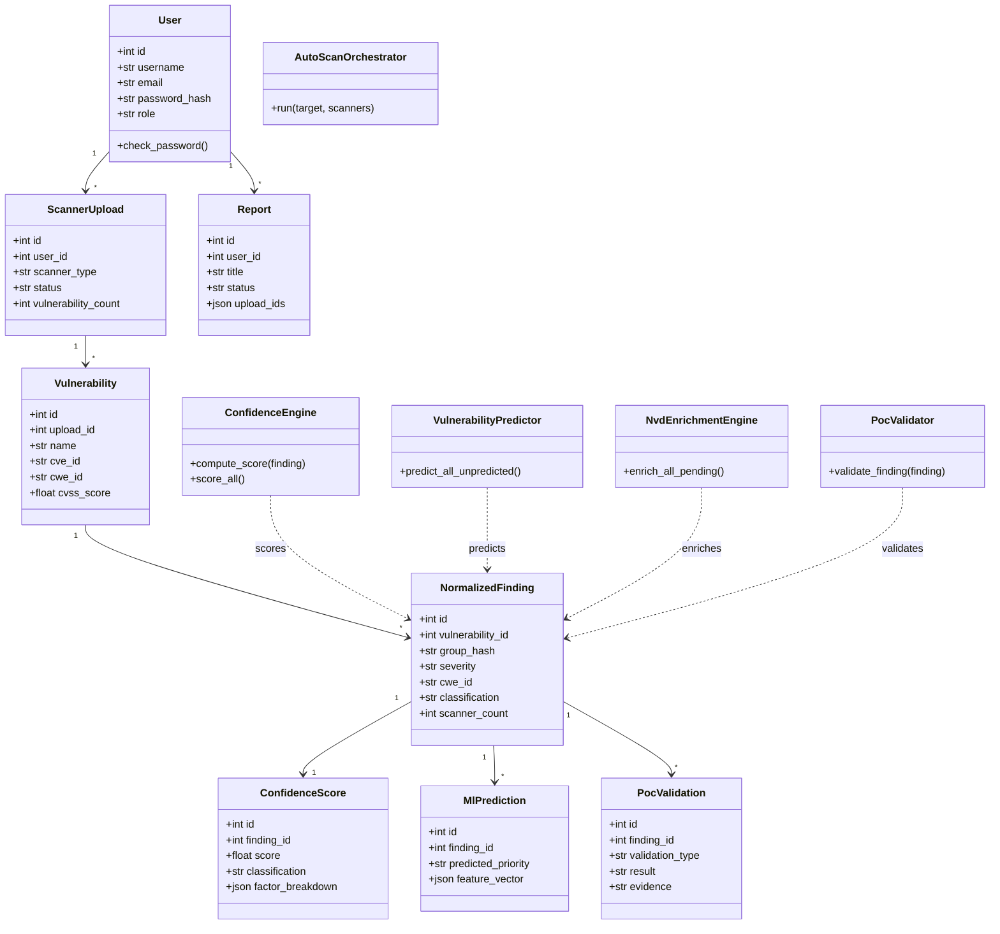
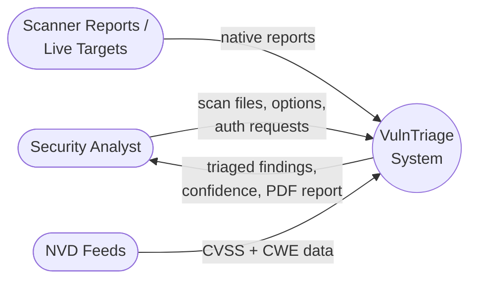
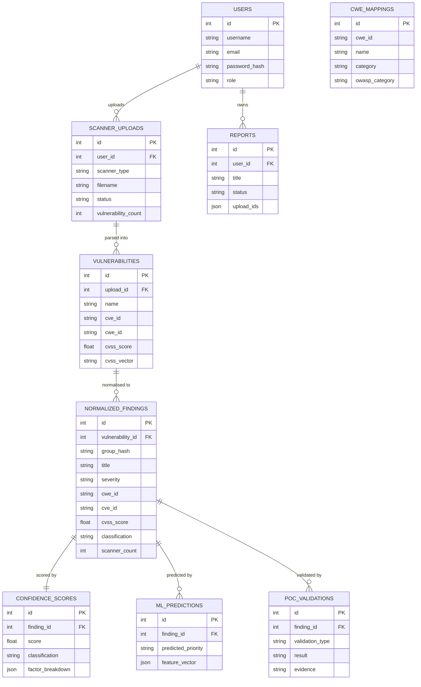
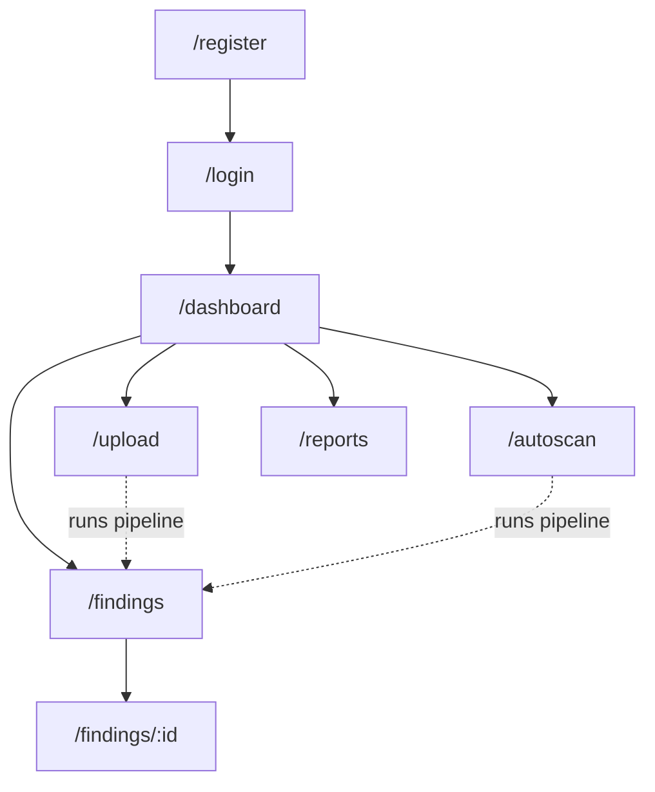
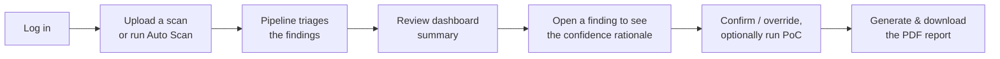

# CHAPTER 4: DESIGN AND IMPLEMENTATION

> **Project:** VulnTriage — AI-Assisted Vulnerability Triage and Confirmation System Using ML and Multi-Scanner Analysis
> **Development model:** Object-Oriented Analysis and Design (OOAD); the UML diagrams below (use case, activity, sequence, class) and the ERD follow this methodology.
>
> *Diagrams are written in Mermaid and render on GitHub, VS Code (with the Mermaid extension), or at mermaid.live. Screenshots in §4.6 are real captures of the running web application.*

---

## 4.1 Introduction

This chapter documents the design and the completed implementation of **VulnTriage**, an AI-assisted vulnerability triage and confirmation system. The system does not perform scanning as its core function; instead it **ingests the output of established security scanners** (OWASP ZAP, Nuclei, and Nessus), then normalises, de-duplicates, enriches, prioritises, and **confidence-scores** each finding so that a security analyst can quickly separate genuine vulnerabilities from the large volume of false positives that scanners typically produce. An optional orchestration layer can additionally *drive* ZAP and Nuclei against an authorised target and feed their reports into the same pipeline.

The chapter is organised as follows. Section 4.2 presents the system design — the layered architecture and the UML models (use case, activity, sequence, class) together with a Data Flow Diagram. Section 4.3 documents the database design as an Entity-Relationship Diagram with a description of each table. Section 4.4 covers the interface design — navigation structure, screen design, and the storyboard of the user journey. Section 4.5 describes the execution of the system across its three deployment modes and the internal triage pipeline. Section 4.6 presents annotated screenshots of the completed product with justification for each. Section 4.7 summarises the chapter.

The system is built with a **Flask + SQLAlchemy** backend exposing a JWT-secured REST API, a **React 18 + Vite + Tailwind** single-page front end, and a **pure-NumPy Random Forest** machine-learning model for severity prioritisation. It runs in three modes from a single codebase: a desktop application, a Dockerised web application, and a command-line interface.

---

## 4.2 Design

### 4.2.1 System Architecture

VulnTriage follows a layered, service-oriented architecture. The **presentation layer** offers three interchangeable front ends (web SPA, desktop window, CLI) that all reach the same **application/API layer**. That layer delegates to a set of independent **engine services** that form the triage pipeline. Engines read and write through the **data layer** (SQLAlchemy ORM over PostgreSQL or SQLite) and draw on three **supporting resources**: the trained ML model, the offline NVD data feeds, and — for the optional Auto Scan — the external scanner binaries.



**Key design decisions.**

- **Separation of scanning from triage.** The core value is triage, so scanners are treated as pluggable *sources*. Each scanner has a dedicated parser that converts its native report into a common `Vulnerability` record; every downstream engine is scanner-agnostic.
- **Engines as independent, single-responsibility services.** Each pipeline stage is a self-contained class that reads findings from the database, performs one transformation, and writes results back. This makes the pipeline testable stage-by-stage and reusable across all three front ends.
- **Offline-first enrichment.** NVD data is read from local JSON feeds streamed straight from `.xz` (constant memory), so enrichment works without internet access; the live NVD API is only a fallback.
- **Explainability by construction.** The Confidence Engine records a per-factor breakdown and a human-readable rationale for every score, which is surfaced in both the UI and the PDF report.

### 4.2.2 Use Case Diagram

The primary actor is the **Security Analyst**. Two supporting actors are external: the **Scanner Tools** (ZAP/Nuclei/Nessus, driven during Auto Scan) and the **NVD Data Source** (the offline feeds / API used for enrichment).



**Use case summary.**

| # | Use case | Description |
|---|----------|-------------|
| UC1 | Register / Log in | Create an account and authenticate; the API issues a JWT used for all subsequent requests. |
| UC2 | Upload scanner report | Submit a ZAP XML, Nuclei JSONL, or Nessus `.nessus` file; the system parses and runs the triage pipeline. |
| UC3 | Run Auto Scan | Drive ZAP and Nuclei against an authorised target, then triage the combined output (requires an explicit authorisation acknowledgement). |
| UC4 | View dashboard | See totals, severity/classification breakdowns, scans-by-tool, and the top findings by CVSS. |
| UC5 | Browse findings | List, search, and filter normalised findings by severity and classification. |
| UC6 | View finding detail | Inspect a finding's confidence score, the six-factor breakdown and rationale, ML prediction, CVSS metrics, and PoC evidence. |
| UC7 | Override classification | Manually set a finding's classification when analyst judgement differs from the automated verdict. |
| UC8 | Run PoC validation | Execute non-destructive proof-of-concept checks against an in-scope target to confirm exploitability. |
| UC9 | Generate report | Produce a PDF triage report and download it. |
| UC10 | Clear session data | Reset the workspace to start a fresh triage session. |

### 4.2.3 Activity Diagram — The Triage Pipeline

The heart of the system is the unified triage pipeline. The activity diagram below shows the flow from an ingested report to a finished PDF report, including the two conditional branches (optional exploit lookup and optional PoC validation) and the PoC-confirmation override.

```mermaid
stateDiagram-v2
    [*] --> Parse
    Parse: Parse scanner report → Vulnerability records
    Parse --> Normalise
    Normalise: Normalise (unify severity, CWE, fields)
    Normalise --> Deduplicate
    Deduplicate: De-duplicate (SHA-256 group hash; merge cross-scanner)
    Deduplicate --> MapCWE
    MapCWE: Map CWE (scanner value → keyword table)
    MapCWE --> EnrichNVD
    EnrichNVD: Enrich from NVD (CVSS vector + CWE back-fill)
    EnrichNVD --> InferVector
    InferVector: Infer CVSS vector from CWE (if none)
    InferVector --> Predict
    Predict: ML prioritisation (Random Forest → severity band)
    Predict --> ExploitCheck
    ExploitCheck: Exploit lookup?
    ExploitCheck --> Score: no
    ExploitCheck --> SearchSploit: yes
    SearchSploit: searchsploit (Exploit-DB)
    SearchSploit --> Score
    Score: Confidence scoring (6 factors → 0–100)
    Score --> PoCDecision
    PoCDecision: Run PoC?
    PoCDecision --> Report: no
    PoCDecision --> RunPoC: yes
    RunPoC: Non-destructive PoC checks
    RunPoC --> Override
    Override: PoC confirmed? force Confirmed
    Override --> Report
    Report: Generate PDF report
    Report --> [*]
```

### 4.2.4 Sequence Diagrams

**(a) Upload and triage.** The most common interaction: the analyst uploads a report through the SPA, and the pipeline runs to completion.



**(b) Auto Scan orchestration.** The optional layer drives the scanners sequentially, then runs one unified pipeline so cross-scanner duplicates merge.



### 4.2.5 Class Diagram

The design cleanly separates **persistent domain models** (SQLAlchemy entities) from **engine services** (stateless processors). The diagram is simplified to the principal classes and relationships.



### 4.2.6 Data Flow Diagram (DFD)

**Level 0 (context).** VulnTriage sits between the analyst and the external data sources.



**Level 1.** The internal processes and data stores.


---

## 4.3 Database Design

The system uses a relational schema of **nine tables** managed through the SQLAlchemy ORM. The models use generic column types (including `db.JSON`), so the identical schema runs on **PostgreSQL** (web/production) and **SQLite** (desktop/CLI). The Entity-Relationship Diagram below shows the entities, their key attributes, and their relationships.



**Table descriptions.**

| Table | Purpose |
|-------|---------|
| `users` | Registered analysts; stores a hashed password and role. Owns uploads and reports. |
| `scanner_uploads` | One row per submitted scan file (or per scanner in an Auto Scan run); tracks scanner type, processing status, and finding count. |
| `vulnerabilities` | Raw findings exactly as parsed from a scanner report, before normalisation — preserves an audit trail of what each tool reported. |
| `normalized_findings` | The canonical, de-duplicated findings that the whole pipeline operates on; carries a SHA-256 `group_hash` for merging, the unified severity/CWE/CVSS fields, `scanner_count` (cross-tool corroboration), and the final `classification`. |
| `confidence_scores` | One score per finding (0–100) plus the six per-factor sub-scores and the JSON `factor_breakdown` used for explainability. |
| `ml_predictions` | The Random Forest's predicted severity band and the exact feature vector used, for traceability. |
| `poc_validations` | Results of non-destructive proof-of-concept checks (type, result, evidence); a confirmed result overrides the classification. |
| `reports` | Generated PDF reports; `upload_ids` (JSON) records which uploads a report covers. |
| `cwe_mappings` | A reference table of CWE identifiers with names and OWASP categories, used for display and seeding. |

The `cwe_mappings` table is a standalone reference (no foreign key). `reports.upload_ids` intentionally uses a JSON array rather than a join table because a report can span an arbitrary set of uploads.

---

## 4.4 Interface Design

The web front end is a single-page application with a **persistent left navigation sidebar** and a content area. The design language is a clean, dark-sidebar / light-content dashboard using Tailwind CSS, prioritising scannability of tabular security data.

### 4.4.1 Navigation Structure



Every authenticated route shares a common layout: the sidebar (Dashboard, Upload Scans, Auto Scan, Findings, Reports) plus a header showing the current user and a Logout control. Unauthenticated users are redirected to `/login`; a `PrivateRoute` guard protects all data routes.

### 4.4.2 Screen and Content Design

- **Dashboard** — an at-a-glance summary: four KPI cards (Total Findings, Confirmed, Needs Review, Total Uploads), three charts (severity breakdown, classification results, scans by tool), and a Top-10-by-CVSS table.
- **Upload Scans** — a form to select the scanner type and file, with toggles for Exploit Lookup and PoC Validation (plus an optional authorisation scope field).
- **Auto Scan** — a target field, scanner check-boxes (ZAP/Nuclei), an authorisation acknowledgement, and a live progress indicator.
- **Findings** — a filterable, sortable table of all normalised findings with severity, CVSS, classification, scanner, and CWE columns.
- **Finding detail** — the deepest screen: the confidence score with its six-factor breakdown and rationale, the ML priority prediction, the CVSS v3 metrics, description/solution, and the PoC evidence.
- **Reports** — a list of generated PDF reports with download links.

### 4.4.3 Storyboard (User Journey)



---

## 4.5 Execution

### 4.5.1 Deployment Modes

From a single codebase, VulnTriage runs in three modes so it suits both interactive analysis and automation:

1. **Desktop application** — a native window (pywebview + waitress) backed by SQLite at the user's data directory; launched from the OS menu. Suited to a single analyst on a workstation.
2. **Dockerised web application** — `docker compose up` serves the built SPA and API together on `localhost:5000`, backed by PostgreSQL. Suited to a shared/team deployment.
3. **Command-line interface** — `python cli.py scan <file> -s <scanner> [--poc] [--exploits] [-o out.pdf]` and `cli.py autoscan <target> -s zap,nuclei --authorise`. Suited to scripting and CI pipelines.

All three share the identical engine pipeline, so results are consistent regardless of how the system is invoked.

### 4.5.2 Pipeline Execution

When a report is ingested (by upload, CLI, or Auto Scan) the engines run in a fixed order, each reading and writing through the ORM:

`normalisation → deduplication → cwe_mapper → nvd_enrichment → cwe_cvss_enrichment → ml/predictor → confidence_engine → (optional) poc_validator → report_generator`

- **Normalisation** unifies severities, CWE identifiers (dropping placeholders such as `CWE-0`), and field names into a common shape.
- **Deduplication** computes a SHA-256 `group_hash` and merges duplicates, including the same issue reported by different scanners — raising `scanner_count`, which strengthens confidence.
- **CWE mapping** fills a weakness class from a curated keyword table when the scanner supplied none.
- **NVD enrichment** streams the offline NVD feeds to fill an authoritative CVSS vector and back-fill a CWE for CVE-bearing findings.
- **CWE→CVSS enrichment** derives a plausible CVSS vector from the CWE for vector-less findings, so the ML model receives real features instead of zeros.
- **ML prioritisation** applies the Random Forest to predict a severity band from the CVSS sub-metrics and CWE.
- **Confidence scoring** combines six reliability factors into a 0–100 score and a classification (≥70 *Confirmed*, 40–69 *Needs Manual Verification*, <40 *Not Confirmed*).
- **PoC validation** (optional) runs non-destructive checks against in-scope targets; a confirmed result overrides the classification to *Confirmed*.
- **Report generation** renders a PDF triage report.

### 4.5.3 Machine-Learning Component

The prioritiser is a **pure-NumPy Random Forest** (inference needs only NumPy; scikit-learn is training-only). It is trained on **108,495** real CVSS-v3 records from the NVD JSON feeds (2023–2025) and predicts the severity band from the eight CVSS sub-metrics plus the CWE — deliberately **excluding** the CVSS base score to avoid target leakage. On a held-out set of 21,697 real records it achieves **accuracy ≈ 0.997 and macro-F1 ≈ 0.994**. The genuinely novel analytic contribution, however, is the **Confidence Engine**, which estimates the likelihood that a finding is a *true positive* — a signal that CVSS alone cannot provide.

---

## 4.6 Screenshot

The following screenshots are real captures of the completed web application, driven against a triaged dataset produced by an Auto Scan of a local test target.

### 4.6.1 Login


*Justification.* The entry point demonstrates the JWT-secured authentication gate. All data routes are protected; unauthenticated access redirects here. The minimal, focused form reflects the design priority of getting an analyst to the workspace quickly.

### 4.6.2 Registration


*Justification.* New analysts self-register; the API hashes the password and issues a token on success. Shown to document the full account-creation path referenced in UC1.

### 4.6.3 Dashboard


*Justification.* This is the analyst's landing view and the clearest demonstration of the system's value. The KPI cards quantify the workload (16 findings, of which only **4 are Confirmed** and **0 need review** — the rest auto-dismissed), the three charts characterise the dataset (severity mix, classification outcome, and cross-tool contribution), and the Top-10 table surfaces the highest-CVSS findings with their classification and CWE. Together they show the triage system converting raw scanner noise into a prioritised, actionable shortlist.

### 4.6.4 Upload Scans


*Justification.* Demonstrates the primary ingestion path (UC2): scanner-type selection, file submission, and the optional Exploit-Lookup / PoC toggles with an authorisation scope. This is where an analyst brings existing ZAP/Nuclei/Nessus output into the pipeline.

### 4.6.5 Auto Scan


*Justification.* Shows the optional orchestration layer (UC3): a target field, scanner selection, and the explicit authorisation acknowledgement that gates all active scanning. This screen embodies the responsible-use design constraint that intrusive scanning is opt-in and confirmed.

### 4.6.6 Findings


*Justification.* The working list (UC5) where an analyst filters and sorts the full set of normalised findings. Each row's classification badge lets the analyst focus immediately on Confirmed items, demonstrating the practical false-positive reduction the project set out to achieve.

### 4.6.7 Finding Detail


*Justification.* The most important screen for the project's thesis. For the confirmed SQL Injection it shows the **confidence score (81.3/100)** with a full **six-factor breakdown** (each factor's contribution, weight, and a plain-language reason) and an overall rationale, alongside the **ML priority prediction** (Critical, 85%), the **CVSS v3 metrics**, the description/solution, and the **PoC validation evidence** that triggered the confirmation. This screen is the concrete realisation of the system's explainable, evidence-backed triage.

### 4.6.8 Reports


*Justification.* Completes the workflow (UC9): generated PDF triage reports are listed and downloadable, providing the deliverable an analyst hands to stakeholders.

---

## 4.7 Summary

This chapter presented the design and completed implementation of VulnTriage using an object-oriented methodology. Section 4.2 established the layered architecture and modelled the system with a use case diagram, an activity diagram of the triage pipeline, sequence diagrams for the upload and Auto Scan flows, a class diagram, and a two-level Data Flow Diagram. Section 4.3 documented the nine-table relational schema as an ERD with per-table descriptions. Section 4.4 described the interface design — navigation, screen content, and the user-journey storyboard. Section 4.5 explained how the system executes across its three deployment modes, detailed the ordered engine pipeline, and summarised the machine-learning component. Section 4.6 presented annotated, real screenshots of the finished product with justification for each.

Together these show a fully realised system that ingests multi-scanner output and, through a normalisation–enrichment–prioritisation–confidence pipeline, produces explainable, prioritised, and confirmation-backed vulnerability findings. The next chapter evaluates the system's performance and effectiveness against the project's objectives.
