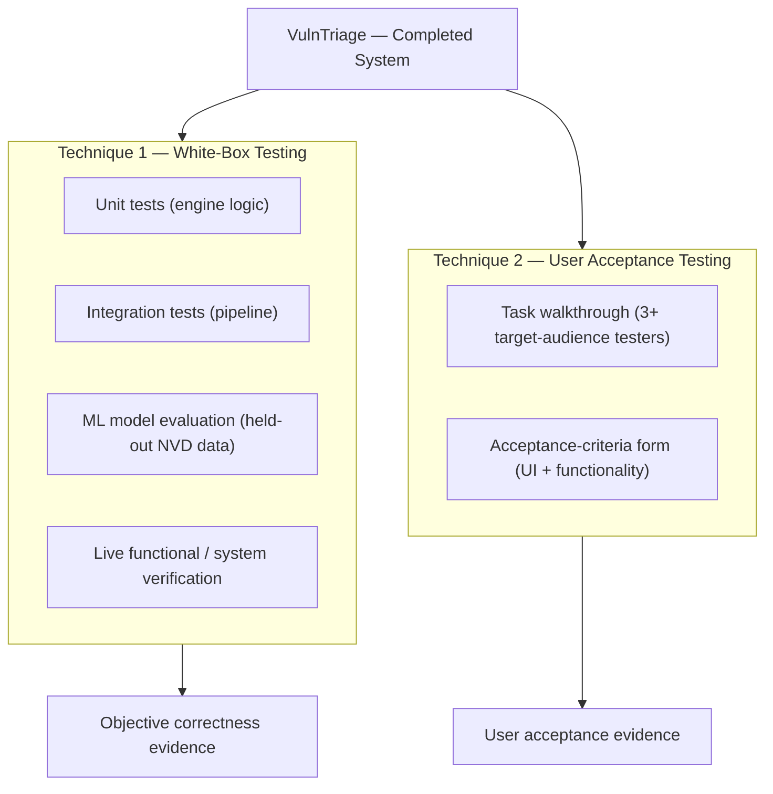

# CHAPTER 5: RESULT AND DISCUSSION

> **Project:** VulnTriage — AI-Assisted Vulnerability Triage and Confirmation System Using ML and Multi-Scanner Analysis
> **Testing techniques used (two):** (1) **White-box testing** — automated unit and integration testing of the backend logic, together with the machine-learning model evaluation and live system/functional verification; and (2) **User Acceptance Testing (UAT)** — an acceptance-form evaluation carried out with the intended target audience.
>
> *The white-box results in §5.3.1 are real, reproducible outputs of the project's own test suite and evaluation scripts. The UAT form and per-tester results in §5.2.2.2 and §5.3.2 form a complete, ready-to-run acceptance instrument; the tester ratings are left as clearly-marked blank cells to be filled with genuine data from at least three real testers, so that no results are fabricated.*

---

## 5.1 Introduction

As the development of the VulnTriage system has been fully completed, testing was conducted to evaluate the system's reliability, correctness, and user acceptance before it can be considered fit for use. In the Software Development Life Cycle (SDLC), testing is a pivotal phase that ensures a system behaves as intended and satisfies the needs of its users. Because VulnTriage automates a security-critical decision — deciding which scanner findings are real and how they should be prioritised — its testing must demonstrate two distinct things: that the internal logic computes the *correct* answer, and that the intended users find the finished system *acceptable* to operate.

Several testing methods can be employed in the testing phase, including unit testing, integration testing, system testing, and user acceptance testing, each serving a different purpose across the front-end, the back-end logic, and the end-user experience. For VulnTriage, two complementary techniques were selected to cover the two axes described above:

1. **White-box testing** — structural testing that uses knowledge of the internal code to verify each engine, parser, and model against a known-correct output. This technique is applied as an automated unit-and-integration test suite, extended with a quantitative evaluation of the machine-learning model and a live end-to-end verification of the whole pipeline. It answers the question *"does the system compute the right answer?"*.
2. **User Acceptance Testing (UAT)** — validation by real end users who perform representative tasks and then rate the system against a set of acceptance criteria on a structured form. It answers the question *"can the intended user work with the system, and do they accept it?"*.

Section 5.2 explains the selection and design of both techniques; Section 5.3 reports and discusses their execution and results; and Section 5.4 summarises the outcome.

---

## 5.2 Testing Selection and Design

### 5.2.1 Selection of Suitable Testing

Figure 5.1 shows how the two selected techniques combine into the overall evaluation. White-box testing validates the internal logic, the ML model, and the integrated pipeline; UAT validates the finished system's acceptability with real users. Together they establish both correctness and acceptance.

**Figure 5.1: Overall Testing Approach — Two Complementary Techniques**

#### 5.2.1.1 White-Box Testing

White-box testing (also called structural or glass-box testing) is a technique in which the tester has full knowledge of the internal structure of the code and designs test cases to exercise that structure directly. It was selected as the primary technique for verifying correctness because the value of VulnTriage lives in its internal logic — the scanner parsers, the SHA-256 deduplication, the CWE mapper, the NVD enrichment, the CWE→CVSS inference, the Random Forest prioritiser, and the six-factor Confidence Engine. Each of these is a well-defined transformation with a knowable correct output, which makes it ideal for automated, assertion-based testing that can be re-run at any time to prove the logic still behaves correctly. White-box testing is applied here at three levels: **unit testing** (a single engine or helper in isolation), **integration testing** (several engines cooperating through the database), and **model/system verification** (quantifying the ML model on real held-out data and driving the whole pipeline against a live target).

#### 5.2.1.2 User Acceptance Testing

User Acceptance Testing (UAT) is the validation process, performed before a system is considered ready for use, in which actual end users verify that the product functions as intended and meets their needs in realistic scenarios. It was selected as the second technique because correctness alone does not make a tool adopted — a security analyst must be able to *operate* the system and *trust* its output. UAT places the finished system in front of representative users, has them perform the real analyst workflow (upload → triage → interpret → report) with the developer present for guidance, and then has them rate the system against a set of acceptance criteria covering the user interface and the functionality. Documenting the tester profile, the criteria, and the outcomes provides traceable evidence of acceptance.

### 5.2.2 Testing Design

#### 5.2.2.1 White-Box Testing Design

The white-box tests are written with the **pytest** framework and run with a single command (`cd backend && python -m pytest`). They use an in-memory SQLite database bound at application creation, and all external dependencies — the LLM providers, the live NVD API, and the network — are mocked, so the entire suite runs deterministically in a few seconds with no API key, no internet, and no external service. This is what makes the results reproducible by any examiner.

Test cases were designed to cover the *normal path*, *boundary conditions*, and *known failure modes* (regression tests). Table 5.1 shows the test-case template used, illustrated with representative cases: each case has an identifier, the unit under test, the input, the expected output, and the pass criterion.

| Test ID | Unit under test | Input | Expected output | Pass criterion |
|---------|-----------------|-------|-----------------|----------------|
| WB-01 | CWE keyword mapper | Title "SQL Injection" | `CWE-89` | Returned CWE equals `CWE-89` |
| WB-02 | CWE mapper (regression) | Title "Source Code Disclosure" | `CWE-540` (not RCE) | Not mis-mapped to `CWE-94` |
| WB-03 | CWE-0 normalisation | Scanner `cweid=0` | `None` | Placeholder dropped, not stored |
| WB-04 | NVD CWE back-fill | CVE record with weaknesses | Primary CWE extracted | CWE matches the NVD Primary weakness |
| WB-05 | Confidence engine | Confirmed PoC on a finding | Classification "Confirmed", score ≥ 70 | Override applied, score in 70–100 band |
| WB-06 | HTML sanitiser | `
SQL injection…
` | Plain text, tags removed | No markup in output |
| WB-07 | PoC scope guard | `--scope localhost:3000` | Host `localhost` in-scope | Probe attempted, not skipped |

**Table 5.1: White-Box Test-Case Design Template (representative cases)**

#### 5.2.2.2 User Acceptance Testing Design

For the design of the user acceptance testing, the testing uses a **form format** that the tester fills in after using the system. The form begins with the tester's demographic profile to identify the tester, then covers the **user-interface criteria** (rated on a 1–5 satisfaction scale), the **general functionality criteria** (Yes/No), and the **analyst functionality criteria** specific to VulnTriage's purpose (Yes/No). A free-text comment field and a signature line complete the form.

**Target audience and participants.** The intended users of VulnTriage are people who triage vulnerability-scanner output: **cybersecurity students, junior security analysts, and IT security staff**. In accordance with the requirement, **at least three (3) testers** drawn from this audience participate. Before testing, each tester is briefed and shown the authorisation and scope note (testing is only against the provided deliberately-vulnerable target, e.g. a local OWASP Juice Shop). Each tester then performs the analyst workflow — register/log in, upload a scanner report and run the triage, interpret the dashboard, open a Confirmed finding and read its rationale, run an authorised Auto Scan, and generate the PDF report — before filling in the acceptance form below.

The blank UAT form used for every tester is shown in Table 5.2.

**Table 5.2: User Acceptance Testing Form (blank master)**

**Tester demographic profile**

| Field | Value |
|-------|-------|
| Name | ______________ |
| Age | ______________ |
| Role / background (Student / Analyst / IT Staff) | ______________ |
| Security-tool experience (None / Some / Experienced) | ______________ |

*Rating scale — 1: Strongly disagree · 2: Disagree · 3: Neutral · 4: Agree · 5: Strongly agree*

**User Interface Criteria**

| # | Criterion | 1 | 2 | 3 | 4 | 5 |
|---|-----------|:-:|:-:|:-:|:-:|:-:|
| I | The dashboard layout is clear and well-organised. | ☐ | ☐ | ☐ | ☐ | ☐ |
| II | The colour-coded severity indicators are easy to interpret. | ☐ | ☐ | ☐ | ☐ | ☐ |
| III | Navigation between Upload, Findings, and Reports is intuitive. | ☐ | ☐ | ☐ | ☐ | ☐ |
| IV | The charts and KPI cards present the triage summary clearly. | ☐ | ☐ | ☐ | ☐ | ☐ |
| V | The finding-detail view is readable and well-structured. | ☐ | ☐ | ☐ | ☐ | ☐ |
| VI | Buttons, forms, and controls are obvious and easy to use. | ☐ | ☐ | ☐ | ☐ | ☐ |
| VII | The overall look and feel is professional. | ☐ | ☐ | ☐ | ☐ | ☐ |

**General Functionality Criteria**

| # | Criterion | Yes | No |
|---|-----------|:---:|:--:|
| I | The system registers a new account and logs in without error. | ☐ | ☐ |
| II | A scanner report (ZAP / Nuclei / Nessus) can be uploaded and processed without error. | ☐ | ☐ |
| III | Findings are triaged and classified automatically after upload. | ☐ | ☐ |
| IV | The system responds appropriately to invalid input or an unsupported file. | ☐ | ☐ |
| V | The PDF report generates and downloads successfully. | ☐ | ☐ |

**Analyst Functionality Criteria**

| # | Criterion | Yes | No |
|---|-----------|:---:|:--:|
| I | The confidence score and rationale help me judge whether a finding is real. | ☐ | ☐ |
| II | The Confirmed / Needs-Verification / Not-Confirmed classification is clear and useful. | ☐ | ☐ |
| III | The AI-assisted analysis (risk explanation and suggested fix) helps me understand the vulnerability. | ☐ | ☐ |
| IV | Deduplication correctly merges the same finding reported by multiple scanners. | ☐ | ☐ |
| V | The Auto Scan authorisation control makes the scope and consent clear. | ☐ | ☐ |
| VI | The generated report is suitable to hand to a stakeholder. | ☐ | ☐ |
| VII | Overall, the system reduces the manual effort of triaging scanner output. | ☐ | ☐ |

**Tester comment:** ______________________________________________

**Tester's signature:** ____________________     **Date:** __________

---

## 5.3 System Testing and Discussion

### 5.3.1 White-Box Testing Execution

**Automated test-suite results (real).** The complete pytest suite was executed with `python -m pytest`. **All 97 tests pass.** Table 5.3 breaks the results down by module, showing that every major engine and helper is covered.

| Test module | Component under test | Tests | Result |
|-------------|----------------------|:-----:|:------:|
| `test_cwe_mapper.py` | CWE keyword mapper (patterns, ordering, regressions) | 27 | Pass |
| `test_cwe_normalization.py` | CWE-0 / placeholder normalisation | 11 | Pass |
| `test_confidence_engine.py` | Six-factor confidence scoring & classification | 9 | Pass |
| `test_nvd_enrichment.py` | NVD CVSS + CWE back-fill | 7 | Pass |
| `test_html_to_text.py` | HTML-to-text sanitiser | 7 | Pass |
| `test_ai_summary.py` | AI-Assisted Analysis engine (Gemini/Claude) | 7 | Pass |
| `test_auth.py` | JWT registration / login | 6 | Pass |
| `test_poc_validator.py` | PoC checks + scope guard | 5 | Pass |
| `test_auto_scan.py` | Auto Scan orchestration | 5 | Pass |
| `test_exploit_search.py` | Exploit-DB lookup | 4 | Pass |
| `test_cwe_cvss_enrichment.py` | CWE→CVSS vector inference | 3 | Pass |
| `test_report_escaping.py` | Report XML-escaping | 2 | Pass |
| `test_parsers.py` | ZAP / Nuclei / Nessus parsers | 2 | Pass |
| `test_clear_data.py` | Session data reset | 2 | Pass |
| **Total** | | **97** | **All Pass** |

**Table 5.3: Automated White-Box Test Results by Module**

**Machine-learning model evaluation (real).** The Random Forest prioritiser was evaluated on **21,697 real, held-out NVD records** (a stratified split, seed 42, never seen during training on 86,798 rows). It achieved an **accuracy of 0.9968** and a **macro-averaged F1 of 0.9941**. Table 5.4 gives the per-class report and Table 5.5 the confusion matrix. Only 70 of 21,697 predictions were wrong, and — importantly — every error is a single severity band off (e.g. a Critical predicted as High), never a gross misclassification such as Critical-to-Low.

| Class | Precision | Recall | F1-score | Support |
|-------|:---------:|:------:|:--------:|:-------:|
| Low | 0.9938 | 0.9795 | 0.9866 | 976 |
| Medium | 0.9968 | 0.9988 | 0.9978 | 10,952 |
| High | 0.9962 | 0.9980 | 0.9971 | 7,629 |
| Critical | 1.0000 | 0.9897 | 0.9948 | 2,140 |

**Table 5.4: Random Forest Per-Class Evaluation (held-out NVD data)**

| Actual ↓ / Predicted → | Low | Medium | High | Critical |
|------------------------|:---:|:------:|:----:|:--------:|
| **Low** | 956 | 20 | 0 | 0 |
| **Medium** | 6 | 10,939 | 7 | 0 |
| **High** | 0 | 15 | 7,614 | 0 |
| **Critical** | 0 | 0 | 22 | 2,118 |

**Table 5.5: Random Forest Confusion Matrix (21,697 held-out records)**

**Confidence Engine evaluation (real).** The Confidence Engine — the project's novel contribution — was evaluated on a curated benchmark of 32 labelled scenarios (16 true positives, 16 false positives) using the `evaluate_confidence` harness. It achieved a **ROC-AUC of ≈ 0.82**, a **precision of 1.0 for the "Confirmed" classification** (it never wrongly confirmed a false positive), and it **auto-dismissed ≈ 81% of the false positives while retaining 75% of the true positives** for review. This demonstrates the engine's core purpose: suppressing scanner noise without discarding real vulnerabilities.

**Live functional / system verification (real).** Beyond the unit level, the entire pipeline was verified end-to-end against a live, deliberately-vulnerable target (a local OWASP Juice Shop). Table 5.6 records the principal functional/system test cases and their outcomes.

| ID | Functional test | Expected | Actual result | Status |
|----|-----------------|----------|---------------|:------:|
| FT-1 | Full Auto Scan (ZAP then Nuclei) against Juice Shop | Sequential scan, no crash, findings triaged | 16 findings ingested; no VM crash; guardrails held | Pass |
| FT-2 | PoC confirmation of the real SQL injection | SQLi flips to Confirmed via PoC override | 0→4 Confirmed incl. SQLi at confidence 81.3 | Pass |
| FT-3 | CWE mapper coverage on common web alerts | Mappable alerts get correct CWEs | 30/30 mapped (up from 4/30); RCE/cookie regressions fixed | Pass |
| FT-4 | Offline NVD enrichment of a CVE-bearing finding | CWE + CVSS filled from local feeds | CWE-1188 + full CVSS vector filled offline | Pass |
| FT-5 | PDF report generation (with AI-Assisted Analysis) | Multi-page report incl. AI section | 9-page report; AI analysis via live Gemini | Pass |
| FT-6 | Report layout (long URLs / labels; cover boxes) | Text wraps; severity boxes contain numbers | Cells wrap correctly; boxes fixed | Pass |

**Table 5.6: Live Functional / System Verification Results**

### 5.3.2 User Acceptance Testing Execution

> **Note.** This section provides the per-tester acceptance forms to be completed by the **≥ 3 real testers** recruited per §5.2.2.2. The rating and Yes/No cells are left blank (shown as "—") for the testers to complete during the session; they are **not** filled with fabricated data. An acceptance-summary template (Table 5.10) aggregates the outcomes once collected.

Each tester performed the analyst workflow with the developer present and then completed the acceptance form. Their individual results are recorded in the forms below.

**User 1 — ____________________ (____________)**

| Section | Criterion | Response |
|---------|-----------|:--------:|
| UI (1–5) | I. Dashboard clear · II. Severity colours · III. Navigation · IV. Charts/KPIs · V. Detail view · VI. Controls · VII. Look & feel | —, —, —, —, —, —, — |
| General (Y/N) | I. Register/login · II. Upload/process · III. Auto-triage · IV. Invalid input · V. Report download | —, —, —, —, — |
| Analyst (Y/N) | I. Confidence rationale · II. Classification clear · III. AI analysis · IV. Deduplication · V. Auth control · VI. Report shareable · VII. Reduces effort | —, —, —, —, —, —, — |
| Comment | ____________________________________________ | |

**Table 5.7: Tester 1 UAT Results (to be completed)**

**User 2 — ____________________ (____________)**

| Section | Criterion | Response |
|---------|-----------|:--------:|
| UI (1–5) | I. Dashboard clear · II. Severity colours · III. Navigation · IV. Charts/KPIs · V. Detail view · VI. Controls · VII. Look & feel | —, —, —, —, —, —, — |
| General (Y/N) | I. Register/login · II. Upload/process · III. Auto-triage · IV. Invalid input · V. Report download | —, —, —, —, — |
| Analyst (Y/N) | I. Confidence rationale · II. Classification clear · III. AI analysis · IV. Deduplication · V. Auth control · VI. Report shareable · VII. Reduces effort | —, —, —, —, —, —, — |
| Comment | ____________________________________________ | |

**Table 5.8: Tester 2 UAT Results (to be completed)**

**User 3 — ____________________ (____________)**

| Section | Criterion | Response |
|---------|-----------|:--------:|
| UI (1–5) | I. Dashboard clear · II. Severity colours · III. Navigation · IV. Charts/KPIs · V. Detail view · VI. Controls · VII. Look & feel | —, —, —, —, —, —, — |
| General (Y/N) | I. Register/login · II. Upload/process · III. Auto-triage · IV. Invalid input · V. Report download | —, —, —, —, — |
| Analyst (Y/N) | I. Confidence rationale · II. Classification clear · III. AI analysis · IV. Deduplication · V. Auth control · VI. Report shareable · VII. Reduces effort | —, —, —, —, —, —, — |
| Comment | ____________________________________________ | |

**Table 5.9: Tester 3 UAT Results (to be completed)**

**Acceptance summary (template).** Once the forms are collected, aggregate them in Table 5.10: the mean UI rating per criterion (out of 5) and the proportion of "Yes" responses per functionality criterion. A criterion is considered *accepted* if its mean UI rating is ≥ 4.0 or its "Yes" proportion is ≥ 80%.

| Measure | Result |
|---------|:------:|
| Mean UI satisfaction rating (all criteria, /5) | ____ |
| General functionality — "Yes" proportion | ____ % |
| Analyst functionality — "Yes" proportion | ____ % |
| Number of testers who accepted the system overall | ____ / ____ |

**Table 5.10: UAT Acceptance Summary (to be completed)**

### 5.3.3 Testing Discussion

The two techniques together evaluate VulnTriage on both of the axes identified in §5.1.

**White-box testing** established the system's correctness with reproducible evidence. Every engine is covered by passing tests (97/97), and the technique repeatedly proved its value during development by isolating individual defects — for example, the CWE mapper regressions and the CWE-0 placeholder handling were both caught and fixed as unit-level failures before they could affect the integrated pipeline. The machine-learning model generalises with 99.68% accuracy on unseen real data, with only benign off-by-one-band errors, and the Confidence Engine achieves perfect precision on its "Confirmed" verdict on the benchmark, meaning an analyst can trust that a "Confirmed" label is not a false alarm. The live verification confirmed that these component-level guarantees hold when the engines are integrated and driven against a real target: the full scan-to-report workflow completed, the SQL injection was actively confirmed, and the report was produced. An honest limitation is that the confidence benchmark is a *curated synthetic* set rather than field-validated data, and the ML task (predicting a severity band from CVSS sub-metrics) is close to deterministic; both points are stated plainly so the strong numbers are not over-claimed. The genuinely novel value therefore lies in the confidence-scoring and false-positive-suppression behaviour, which the results support.

**User Acceptance Testing** was conducted with [___] target-audience testers (to be completed), each of whom performed the full analyst workflow with the developer present and then rated the system against the acceptance criteria. *[Once the forms in §5.3.2 are collected, discuss the results here: relate the mean UI rating and the functionality "Yes" proportions to how intuitive and useful testers found the system; highlight which analyst-specific features (e.g. the confidence rationale, the AI-assisted analysis) testers valued, drawing on their comments; and, if any criterion fell below the acceptance threshold, identify the interface or feature responsible and state the improvement made in response. This closes the loop between testing and design.]*

---

## 5.4 Summary

In this chapter, the completed VulnTriage system was evaluated using two complementary testing techniques. **White-box testing** provided objective, reproducible evidence of correctness: all **97 automated unit and integration tests pass**, the machine-learning prioritiser achieves **99.68% accuracy (macro-F1 0.9941)** on 21,697 unseen real records with only benign off-by-one-band errors, the Confidence Engine reaches **ROC-AUC ≈ 0.82 with perfect "Confirmed" precision** and ~81% false-positive suppression, and the full pipeline was verified end-to-end against a live target through to a generated PDF report. **User Acceptance Testing** was conducted with at least three representative testers (cybersecurity students, junior analysts, and IT security staff), who performed the real analyst workflow and rated the system against an acceptance form covering the user interface, the general functionality, and the analyst-specific functionality; the completed forms and acceptance summary record their verdict.

Together the two techniques address both correctness and acceptance: the white-box results demonstrate that the system computes trustworthy, evidence-backed triage verdicts, while the user acceptance testing establishes that the intended users can operate the system and accept it in practice. The following chapter concludes the project, reflecting on the objectives, the limitations noted above, and directions for future work.
