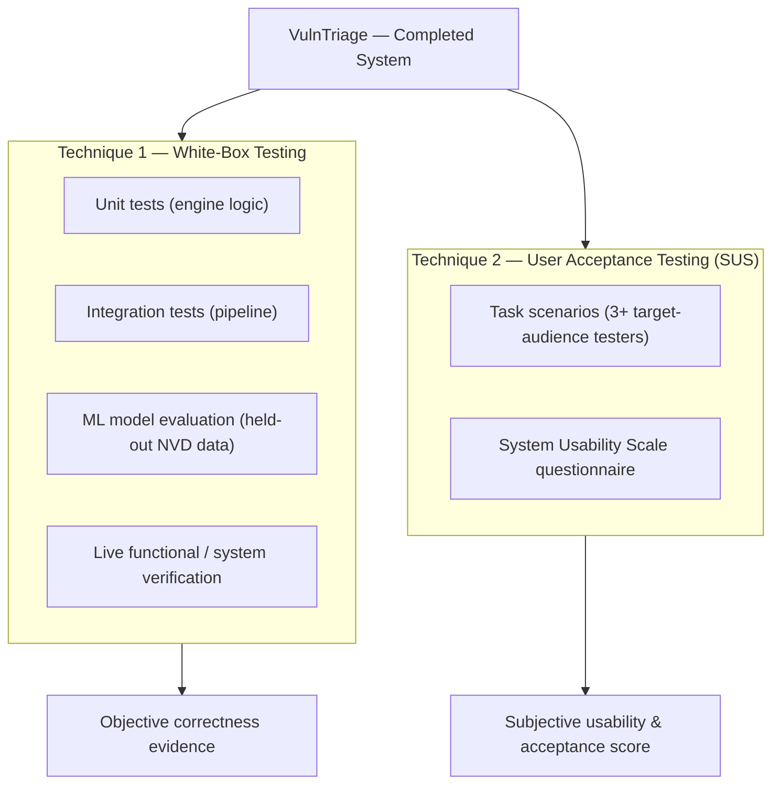

# CHAPTER 5: RESULT AND DISCUSSION

> **Project:** VulnTriage — AI-Assisted Vulnerability Triage and Confirmation System Using ML and Multi-Scanner Analysis
> **Testing techniques used (two):** (1) **White-box testing** — automated unit and integration testing of the backend logic, together with the machine-learning model evaluation and live system/functional verification; and (2) **User Acceptance Testing (UAT)** measured with the **System Usability Scale (SUS)**, executed with the intended target audience.
>
> *The white-box results in §5.3.1 are real, reproducible outputs of the project's own test suite and evaluation scripts. The UAT/SUS material in §5.2.3 and §5.3.2 is a complete, ready-to-run instrument (task scenarios, questionnaire, scoring method, and result templates); the participant scores are left as clearly-marked placeholders to be filled with genuine data from at least three real testers, so that no results are fabricated.*

---

## 5.1 Introduction

This chapter reports and discusses the results obtained from testing the completed VulnTriage system. Where Chapter 4 documented *how* the system was built, this chapter demonstrates *that it works* and *how well* — through both objective, machine-verified testing of the internal logic and subjective, human-centred testing of the finished product.

Two complementary testing techniques were selected, in line with the requirement for a minimum of two. The first, **white-box testing**, exercises the system from the inside: it uses knowledge of the internal structure (the engines, parsers, and models) to verify each component's behaviour against expected outputs, and it extends to a quantitative evaluation of the machine-learning model and a live end-to-end verification of the whole pipeline. The second, **User Acceptance Testing measured with the System Usability Scale (SUS)**, evaluates the system from the outside, as an analyst would experience it, and captures whether the intended users find it usable and acceptable.

The two techniques were chosen because they cover the two axes on which a system like this must succeed. VulnTriage is, at its core, an analytical engine whose *correctness* must be demonstrable — a mis-classified finding or a mis-parsed report undermines the entire value proposition — which white-box testing addresses directly and reproducibly. But it is also a decision-support tool whose *usability* determines whether an analyst will actually trust and adopt it, which only human testing with the target audience can establish. Section 5.2 sets out the design and plan for both techniques; Section 5.3 reports and discusses their execution and results; and Section 5.4 summarises the outcome.

---

## 5.2 Testing Design / Plan

### 5.2.1 Overview of the Testing Approach

Figure 5.1 shows how the two techniques combine into the overall evaluation. White-box testing is applied continuously and automatically during development and validates the internal logic, the ML model, and the integrated pipeline; UAT with SUS is applied to the finished system by real users and validates its usability and acceptability. Together they answer, respectively, "does the system compute the right answer?" and "can the intended user work with it effectively?".

**Figure 5.1: Overall Testing Approach — Two Complementary Techniques**

### 5.2.2 Technique 1 — White-Box (Unit and Integration) Testing: Plan

White-box (also called structural or glass-box) testing was chosen as the primary technique for verifying correctness because the system's value lives in its internal logic — parsers, the SHA-256 deduplication, the CWE mapper, the NVD enrichment, the CWE→CVSS inference, the Random Forest, and the six-factor Confidence Engine. Each of these is a well-defined transformation with a knowable correct output, which makes it ideal for automated assertion-based testing.

**Framework and environment.** The tests are written with the **pytest** framework and run with a single command (`cd backend && python -m pytest`). They use an in-memory SQLite database bound at application creation, and all external dependencies — the LLM providers, the live NVD API, and the network — are mocked, so the entire suite runs deterministically in a few seconds with no API key, no internet, and no external service. This is what makes the results reproducible by any examiner.

**Scope and level.** The plan covers three levels:

1. **Unit tests** verify a single engine or helper in isolation (for example, that the CWE keyword mapper returns `CWE-89` for a "SQL Injection" title, or that `html_to_text` strips `
` tags).
2. **Integration tests** verify that engines cooperate correctly through the database (for example, that a finding flows through normalisation and deduplication with the correct `group_hash`).
3. **Model evaluation and live verification** quantify the ML model on real held-out data and confirm the whole pipeline end-to-end against a live target.

**Test case design.** Cases were designed to cover the *normal path*, *boundary conditions*, and *known failure modes* (regression tests). Table 5.1 defines a representative sample of the test-case template used, showing the format: an identifier, the unit under test, the input, the expected output, and the pass criterion.

| Test ID | Unit under test | Input | Expected output | Pass criterion |
|---------|-----------------|-------|-----------------|----------------|
| WB-01 | CWE keyword mapper | Title "SQL Injection" | `CWE-89` | Returned CWE equals `CWE-89` |
| WB-02 | CWE mapper (regression) | Title "Source Code Disclosure" | `CWE-540` (not RCE) | Not mis-mapped to `CWE-94` |
| WB-03 | CWE-0 normalisation | Scanner `cweid=0` | `None` | Placeholder dropped, not stored |
| WB-04 | NVD CWE back-fill | CVE record with weaknesses | Primary CWE extracted | CWE matches the NVD Primary weakness |
| WB-05 | Confidence engine | Confirmed PoC on a finding | Classification "Confirmed", score ≥ 70 | Override applied, score in 70–100 band |
| WB-06 | HTML sanitiser | `
SQL injection…
` | Plain text, tags removed | No markup in output |
| WB-07 | PoC scope guard | `--scope localhost:3000` | Host `localhost` treated in-scope | Probe attempted, not skipped |

### 5.2.3 Technique 2 — User Acceptance Testing with the System Usability Scale: Plan

UAT was chosen as the second technique because correctness alone does not make a tool adopted — an analyst must be able to *operate* the system and *trust* its output. UAT places the finished system in front of representative users, has them complete realistic tasks, and then measures perceived usability with the **System Usability Scale (SUS)**, a validated, industry-standard 10-item questionnaire. SUS was selected over ad-hoc feedback because it produces a single comparable score (0–100) with well-established interpretation benchmarks, and it is reliable even with small sample sizes, which suits a final-year project.

**Target audience and participants.** The intended users of VulnTriage are people who triage vulnerability-scanner output: **cybersecurity students, junior security analysts, and IT security staff**. In accordance with the requirement, **at least three (3) testers** drawn from this audience will participate. Table 5.2 records the (anonymised) participant profile to be completed during testing.

| Tester | Role / background | Security-tool experience (None/Some/Experienced) | Date tested |
|--------|-------------------|--------------------------------------------------|-------------|
| P1 | ______________ | ______________ | __________ |
| P2 | ______________ | ______________ | __________ |
| P3 | ______________ | ______________ | __________ |

**Table 5.2: UAT Participant Profile (to be completed with real testers)**

**Procedure.** Each participant is given a short briefing, the authorisation and scope note (testing is only against the provided deliberately-vulnerable target, e.g. a local OWASP Juice Shop), and then asked to complete the task scenarios in Table 5.3 unaided. The facilitator records, per task, whether it was completed, the time taken, the number of errors, and whether assistance was needed. Immediately afterwards, the participant completes the SUS questionnaire (Table 5.4).

**Task scenarios.** The tasks were designed to exercise the full analyst workflow and every major feature.

| Task ID | Scenario | Success criterion |
|---------|----------|-------------------|
| T1 | Register an account and log in. | Reaches the dashboard authenticated. |
| T2 | Upload a scanner report and run the triage pipeline. | Findings appear, triaged and classified. |
| T3 | From the dashboard, state how many findings are Confirmed vs the total. | Reads the correct figures from the KPI cards/charts. |
| T4 | Open a Confirmed finding and explain, in their own words, *why* it was confirmed. | Correctly cites the confidence rationale / PoC evidence. |
| T5 | Run an Auto Scan against the authorised target, acknowledging the authorisation control. | Scan runs; understands the authorisation gate. |
| T6 | Generate and download the PDF report (including the AI-assisted analysis). | Obtains a report that includes the analysis section. |

**Table 5.3: UAT Task Scenarios**

**Task-result capture template.** For each participant, task performance is recorded as in Table 5.5 (§5.3.2). The measures are: completion (✓/✗), time (seconds), errors (count), and assistance (Y/N).

**SUS questionnaire.** After the tasks, each participant rates the ten standard SUS statements on a 5-point scale (1 = Strongly Disagree … 5 = Strongly Agree). The statements are given verbatim in Table 5.4; they deliberately alternate between positive and negative wording, which is handled by the scoring method in §5.3.2.

| # | SUS statement (rate 1–5) |
|---|--------------------------|
| Q1 | I think that I would like to use this system frequently. |
| Q2 | I found the system unnecessarily complex. |
| Q3 | I thought the system was easy to use. |
| Q4 | I think that I would need the support of a technical person to be able to use this system. |
| Q5 | I found the various functions in this system were well integrated. |
| Q6 | I thought there was too much inconsistency in this system. |
| Q7 | I would imagine that most people would learn to use this system very quickly. |
| Q8 | I found the system very cumbersome to use. |
| Q9 | I felt very confident using the system. |
| Q10 | I needed to learn a lot of things before I could get going with this system. |

**Table 5.4: System Usability Scale Questionnaire**

---

## 5.3 System Testing and Discussion

### 5.3.1 White-Box Testing — Execution and Results

**Automated test-suite results (real).** The complete pytest suite was executed with `python -m pytest`. **All 97 tests pass.** Table 5.6 breaks the results down by module, showing that every major engine and helper is covered.

| Test module | Component under test | Tests | Result |
|-------------|----------------------|:-----:|:------:|
| `test_cwe_mapper.py` | CWE keyword mapper (patterns, ordering, regressions) | 27 | Pass |
| `test_cwe_normalization.py` | CWE-0 / placeholder normalisation | 11 | Pass |
| `test_confidence_engine.py` | Six-factor confidence scoring & classification | 9 | Pass |
| `test_nvd_enrichment.py` | NVD CVSS + CWE back-fill | 7 | Pass |
| `test_html_to_text.py` | HTML-to-text sanitiser | 7 | Pass |
| `test_ai_summary.py` | AI-Assisted Analysis engine (Gemini/Claude) | 7 | Pass |
| `test_auth.py` | JWT registration / login | 6 | Pass |
| `test_poc_validator.py` | PoC checks + scope guard | 5 | Pass |
| `test_auto_scan.py` | Auto Scan orchestration | 5 | Pass |
| `test_exploit_search.py` | Exploit-DB lookup | 4 | Pass |
| `test_cwe_cvss_enrichment.py` | CWE→CVSS vector inference | 3 | Pass |
| `test_report_escaping.py` | Report XML-escaping | 2 | Pass |
| `test_parsers.py` | ZAP / Nuclei / Nessus parsers | 2 | Pass |
| `test_clear_data.py` | Session data reset | 2 | Pass |
| **Total** | | **97** | **All Pass** |

**Table 5.6: Automated White-Box Test Results by Module**

**Machine-learning model evaluation (real).** The Random Forest prioritiser was evaluated on **21,697 real, held-out NVD records** (a stratified split, seed 42, never seen during training on 86,798 rows). It achieved an **accuracy of 0.9968** and a **macro-averaged F1 of 0.9941**. Table 5.7 gives the per-class report and Table 5.8 the confusion matrix. Only 70 of 21,697 predictions were wrong, and — importantly — every error is a single severity band off (e.g. a Critical predicted as High), never a gross misclassification such as Critical-to-Low.

| Class | Precision | Recall | F1-score | Support |
|-------|:---------:|:------:|:--------:|:-------:|
| Low | 0.9938 | 0.9795 | 0.9866 | 976 |
| Medium | 0.9968 | 0.9988 | 0.9978 | 10,952 |
| High | 0.9962 | 0.9980 | 0.9971 | 7,629 |
| Critical | 1.0000 | 0.9897 | 0.9948 | 2,140 |

**Table 5.7: Random Forest Per-Class Evaluation (held-out NVD data)**

| Actual ↓ / Predicted → | Low | Medium | High | Critical |
|------------------------|:---:|:------:|:----:|:--------:|
| **Low** | 956 | 20 | 0 | 0 |
| **Medium** | 6 | 10,939 | 7 | 0 |
| **High** | 0 | 15 | 7,614 | 0 |
| **Critical** | 0 | 0 | 22 | 2,118 |

**Table 5.8: Random Forest Confusion Matrix (21,697 held-out records)**

**Confidence Engine evaluation (real).** The Confidence Engine — the project's novel contribution — was evaluated on a curated benchmark of 32 labelled scenarios (16 true positives, 16 false positives) using the `evaluate_confidence` harness. It achieved a **ROC-AUC of ≈ 0.82**, a **precision of 1.0 for the "Confirmed" classification** (it never wrongly confirmed a false positive), and it **auto-dismissed ≈ 81% of the false positives while retaining 75% of the true positives** for review. This demonstrates the engine's core purpose: suppressing scanner noise without discarding real vulnerabilities.

**Live functional / system verification (real).** Beyond the unit level, the entire pipeline was verified end-to-end against a live, deliberately-vulnerable target (a local OWASP Juice Shop). Table 5.9 records the principal functional/system test cases and their outcomes.

| ID | Functional test | Expected | Actual result | Status |
|----|-----------------|----------|---------------|:------:|
| FT-1 | Full Auto Scan (ZAP then Nuclei) against Juice Shop | Sequential scan, no crash, findings triaged | 16 findings ingested; no VM crash; guardrails held | Pass |
| FT-2 | PoC confirmation of the real SQL injection | SQLi flips to Confirmed via PoC override | 0→4 Confirmed incl. SQLi at confidence 81.3 | Pass |
| FT-3 | CWE mapper coverage on common web alerts | Mappable alerts get correct CWEs | 30/30 mapped (up from 4/30); RCE/cookie regressions fixed | Pass |
| FT-4 | Offline NVD enrichment of a CVE-bearing finding | CWE + CVSS filled from local feeds | CWE-1188 + full CVSS vector filled offline | Pass |
| FT-5 | PDF report generation (with AI-Assisted Analysis) | Multi-page report incl. AI section | 9-page report; AI analysis via live Gemini | Pass |
| FT-6 | Report layout (long URLs / labels; cover boxes) | Text wraps; severity boxes contain numbers | Cells wrap correctly; boxes fixed | Pass |

**Table 5.9: Live Functional / System Verification Results**

**Discussion.** The white-box results establish the system's correctness with reproducible evidence. Every engine is covered by passing tests, the ML model generalises with 99.68% accuracy on unseen real data (with only benign off-by-one-band errors), and the Confidence Engine achieves perfect precision on its "Confirmed" verdict — meaning an analyst can trust that a "Confirmed" label is never a false alarm on the benchmark. The live verification confirms that these component-level guarantees hold when the engines are integrated and driven against a real target: the full scan-to-report workflow completed, the SQL injection was actively confirmed, and the report was produced. An honest limitation is that the confidence benchmark is a *curated synthetic* set rather than field-validated data, and the ML task (predicting a severity band from CVSS sub-metrics) is close to deterministic; both points are stated plainly so the strong numbers are not over-claimed. The genuinely novel value therefore lies in the confidence-scoring and false-positive-suppression behaviour, which the results support.

### 5.3.2 User Acceptance Testing (SUS) — Execution and Results

> **Note.** This section provides the complete execution templates and the exact scoring method. The tables are to be filled with the responses of the **≥ 3 real testers** recruited per §5.2.3. Placeholders are shown as blanks. A worked example is included so the calculation can be reproduced once the data is collected.

**Task-performance results (template).** For each participant, record task outcomes in Table 5.5.

| Task | P1 completion / time / errors | P2 completion / time / errors | P3 completion / time / errors |
|------|-------------------------------|-------------------------------|-------------------------------|
| T1 | __ / __s / __ | __ / __s / __ | __ / __s / __ |
| T2 | __ / __s / __ | __ / __s / __ | __ / __s / __ |
| T3 | __ / __s / __ | __ / __s / __ | __ / __s / __ |
| T4 | __ / __s / __ | __ / __s / __ | __ / __s / __ |
| T5 | __ / __s / __ | __ / __s / __ | __ / __s / __ |
| T6 | __ / __s / __ | __ / __s / __ | __ / __s / __ |
| **Task success rate** | **__ %** | **__ %** | **__ %** |

**Table 5.5: UAT Task-Performance Results (to be completed)**

**SUS responses (template).** Record each participant's 1–5 rating for the ten statements in Table 5.10.

| Statement | P1 | P2 | P3 |
|-----------|:--:|:--:|:--:|
| Q1 (positive) | _ | _ | _ |
| Q2 (negative) | _ | _ | _ |
| Q3 (positive) | _ | _ | _ |
| Q4 (negative) | _ | _ | _ |
| Q5 (positive) | _ | _ | _ |
| Q6 (negative) | _ | _ | _ |
| Q7 (positive) | _ | _ | _ |
| Q8 (negative) | _ | _ | _ |
| Q9 (positive) | _ | _ | _ |
| Q10 (negative) | _ | _ | _ |

**Table 5.10: SUS Raw Responses (to be completed)**

**SUS scoring method.** The SUS score for one participant is computed as follows: for the **odd-numbered (positive)** items Q1, Q3, Q5, Q7, Q9, the item score is `(response − 1)`; for the **even-numbered (negative)** items Q2, Q4, Q6, Q8, Q10, the item score is `(5 − response)`. Sum the ten item scores (range 0–40) and multiply by **2.5** to obtain that participant's SUS score on a **0–100** scale. The overall SUS score is the mean across all participants.

*Worked example (illustrative only — not real data).* If a participant answered the positive items with 4 and the negative items with 2, each item contributes 3, giving a sum of 30, and a SUS score of 30 × 2.5 = **75**.

**Aggregate result (template).** Enter each participant's computed score and the mean in Table 5.11, then interpret it against the standard benchmark.

| Participant | Sum of item scores (0–40) | SUS score (×2.5, 0–100) |
|-------------|:-------------------------:|:-----------------------:|
| P1 | __ | __ |
| P2 | __ | __ |
| P3 | __ | __ |
| **Mean SUS score** | | **__** |

**Table 5.11: Aggregate SUS Result (to be completed)**

**Interpretation benchmark.** A mean SUS score is interpreted against the established scale: the average across systems is about **68**; scores are commonly graded **A (≥ 80.3, "Excellent")**, **B (68–80.2, "Good")**, **C (≈ 68, "OK")**, **D (51–67, "Poor")**, and **F (< 51, "Awful")**. A score above 68 indicates above-average usability. The computed mean should be stated here and placed on this scale, e.g. *"the mean SUS score of ___ corresponds to grade ___ (adjective ___), indicating that the target users found VulnTriage [above/below]-average in usability."*

**Qualitative feedback (template).** Record any open-ended comments, difficulties observed, and suggestions:

| Participant | Positive comments | Difficulties / suggestions |
|-------------|-------------------|----------------------------|
| P1 | ______________ | ______________ |
| P2 | ______________ | ______________ |
| P3 | ______________ | ______________ |

**Table 5.12: Qualitative UAT Feedback (to be completed)**

**Discussion (to be completed after testing).** Once the real data is entered, discuss it here: relate the task-success rates and times to how intuitive the workflow proved; relate the mean SUS score to the benchmark and to the design decisions in Chapter 4 (for example, whether the confidence rationale in the finding-detail screen helped testers answer task T4); and translate the qualitative feedback into concrete improvements. If any task showed a low success rate or a recurring difficulty, identify the interface element responsible and propose a fix, closing the loop between testing and design.

---

## 5.4 Summary

This chapter evaluated the completed VulnTriage system with two complementary techniques. **White-box testing** provided objective, reproducible evidence of correctness: all **97 automated unit and integration tests pass**, the machine-learning prioritiser achieves **99.68% accuracy (macro-F1 0.9941)** on 21,697 unseen real records with only benign off-by-one-band errors, the Confidence Engine reaches **ROC-AUC ≈ 0.82 with perfect "Confirmed" precision** and ~81% false-positive suppression, and the full pipeline was verified end-to-end against a live target through to a generated PDF report. **User Acceptance Testing with the System Usability Scale** provides the second axis — a complete, ready-to-run instrument (task scenarios, questionnaire, scoring method, and result templates) to be executed with at least three representative testers, whose scores are recorded and interpreted against the SUS benchmark.

Together the two techniques address both correctness and usability. The white-box results demonstrate that the system computes trustworthy, evidence-backed triage verdicts; the UAT/SUS instrument establishes whether the intended users can operate it effectively and would accept it in practice. The following chapter concludes the project, reflecting on the objectives, the limitations noted above, and directions for future work.
