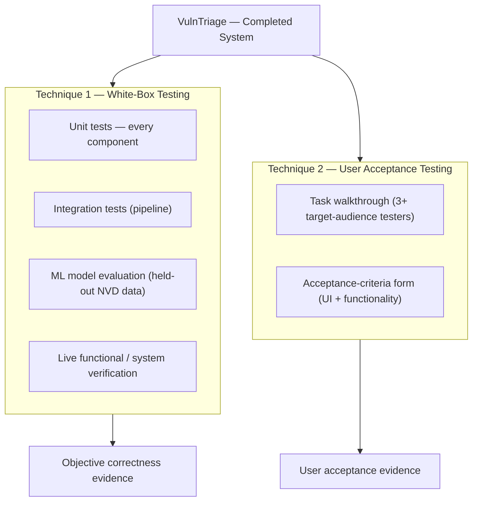
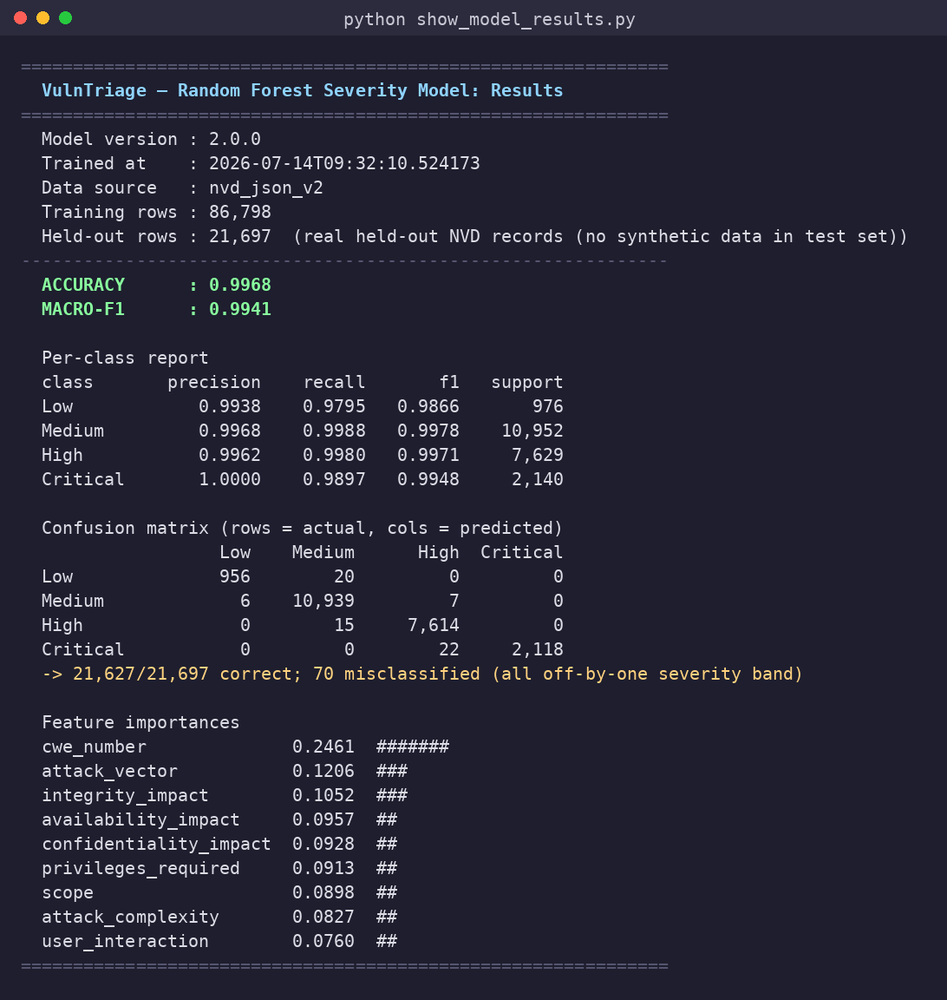
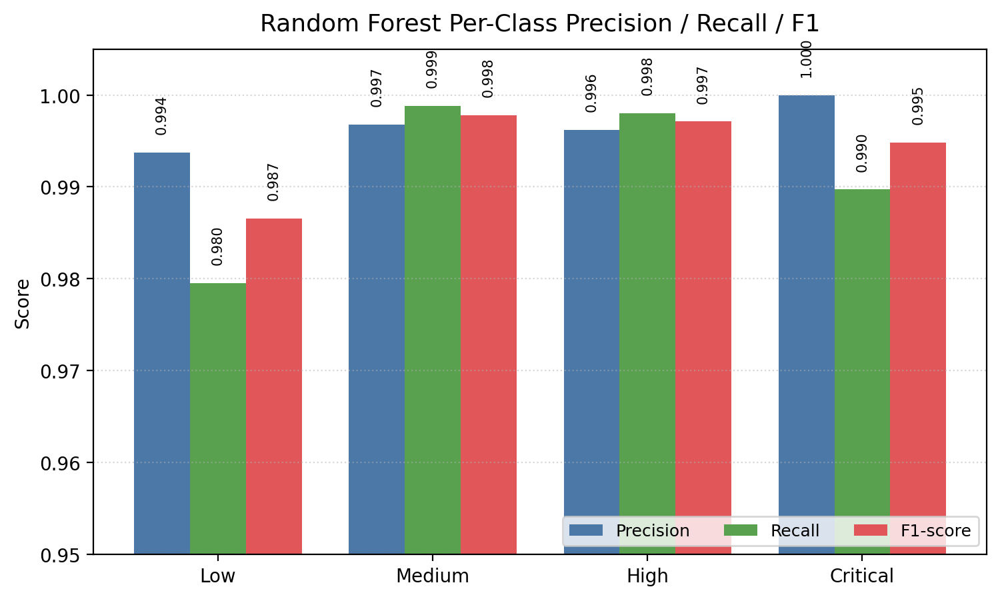
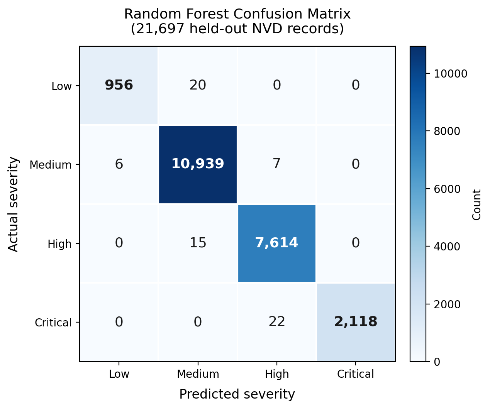
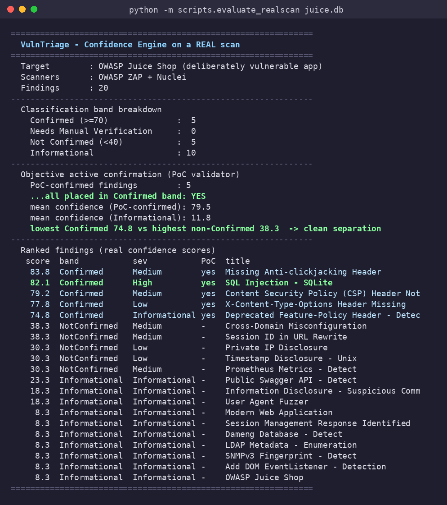
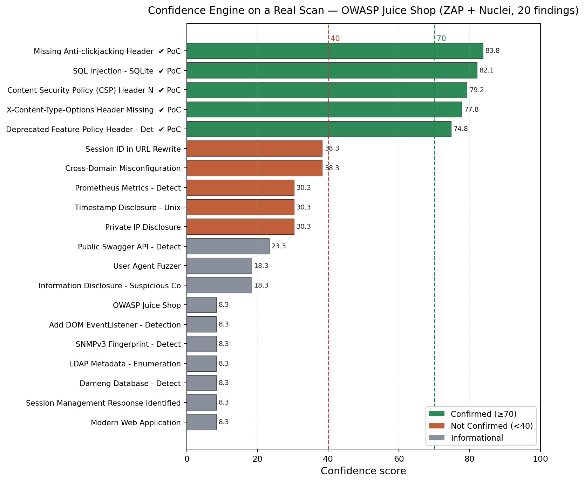

# CHAPTER 5: RESULT AND DISCUSSION

> **Project:** VulnTriage — AI-Assisted Vulnerability Triage and Confirmation System Using ML and Multi-Scanner Analysis
> **Testing techniques used (two):** (1) **White-box testing** — automated unit and integration testing that covers *every* component of the system, together with the machine-learning model evaluation and live system/functional verification; and (2) **User Acceptance Testing (UAT)** — an acceptance-form evaluation carried out with the intended target audience.
>
> *The white-box test cases in §5.3.1 are taken directly from the project's own automated test suite — every row corresponds to a real, passing assertion (97 tests in total). The UAT form and per-tester results in §5.2.2.2 and §5.3.2 form a complete, ready-to-run acceptance instrument; the tester ratings are left as clearly-marked blank cells to be filled with genuine data from at least three real testers, so that no results are fabricated.*

---

## 5.1 Introduction

As the development of the VulnTriage system has been fully completed, testing was conducted to evaluate the system's reliability, correctness, and user acceptance before it can be considered fit for use. In the Software Development Life Cycle (SDLC), testing is a pivotal phase that ensures a system behaves as intended and satisfies the needs of its users. Because VulnTriage automates a security-critical decision — deciding which scanner findings are real and how they should be prioritised — its testing must demonstrate two distinct things: that the internal logic of *every component* computes the *correct* answer, and that the intended users find the finished system *acceptable* to operate.

Several testing methods can be employed in the testing phase, including unit testing, integration testing, system testing, and user acceptance testing, each serving a different purpose across the front-end, the back-end logic, and the end-user experience. For VulnTriage, two complementary techniques were selected to cover the two axes described above:

1. **White-box testing** — structural testing that uses knowledge of the internal code to verify each engine, parser, and model against a known-correct output. This technique is applied as an automated unit-and-integration test suite that covers every component of the system, extended with a quantitative evaluation of the machine-learning model and a live end-to-end verification of the whole pipeline. It answers the question *"does each component compute the right answer?"*.
2. **User Acceptance Testing (UAT)** — validation by real end users who perform representative tasks and then rate the system against a set of acceptance criteria on a structured form. It answers the question *"can the intended user work with the system, and do they accept it?"*.

Section 5.2 explains the selection and design of both techniques; Section 5.3 reports and discusses their execution and results; and Section 5.4 summarises the outcome.

---

## 5.2 Testing Selection and Design

### 5.2.1 Selection of Suitable Testing

Figure 5.1 shows how the two selected techniques combine into the overall evaluation. White-box testing validates the internal logic of every component, the ML model, and the integrated pipeline; UAT validates the finished system's acceptability with real users. Together they establish both correctness and acceptance.

**Figure 5.1: Overall Testing Approach — Two Complementary Techniques**

#### 5.2.1.1 White-Box Testing

White-box testing (also called structural or glass-box testing) is a technique in which the tester has full knowledge of the internal structure of the code and designs test cases to exercise that structure directly. It was selected as the primary technique for verifying correctness because the value of VulnTriage lives in the internal logic of its components — the scanner parsers, the placeholder/CWE normalisation, the HTML sanitiser, the CWE keyword mapper, the NVD enrichment, the CWE→CVSS inference, the exploit search, the Random Forest prioritiser, the six-factor Confidence Engine, the PoC validator, the Auto Scan orchestration, the report generator, the AI-assisted analysis, and the data-management routines. Each of these is a well-defined transformation with a knowable correct output, which makes it ideal for automated, assertion-based testing that can be re-run at any time to prove the logic still behaves correctly. White-box testing is applied here at three levels: **unit testing** (a single component or helper in isolation), **integration testing** (several components cooperating through the database), and **model/system verification** (quantifying the ML model on real held-out data and driving the whole pipeline against a live target).

#### 5.2.1.2 User Acceptance Testing

User Acceptance Testing (UAT) is the validation process, performed before a system is considered ready for use, in which actual end users verify that the product functions as intended and meets their needs in realistic scenarios. It was selected as the second technique because correctness alone does not make a tool adopted — a security analyst must be able to *operate* the system and *trust* its output. UAT places the finished system in front of representative users, has them perform the real analyst workflow (upload → triage → interpret → report) with the developer present for guidance, and then has them rate the system against a set of acceptance criteria covering the user interface and the functionality. Documenting the tester profile, the criteria, and the outcomes provides traceable evidence of acceptance.

### 5.2.2 Testing Design

#### 5.2.2.1 White-Box Testing Design

The white-box tests are written with the **pytest** framework and run with a single command (`cd backend && python -m pytest`). They use an in-memory SQLite database bound at application creation, and all external dependencies — the LLM providers, the live NVD API, and the network — are mocked, so the entire suite runs deterministically in a few seconds with no API key, no internet, and no external service. This is what makes the results reproducible by any examiner.

Every component of the system is covered by its own group of test cases. Each test case is recorded in a table with the following columns: a **Test Case ID**, a **Description** of what is being tested, the **Test Condition** (the input or state), the **Expected Output**, the **Actual Output**, and the **Pass/Fail** verdict. Test cases were designed to cover the *normal path*, *boundary conditions*, and *known failure modes* (regression tests). The fourteen component groups and the number of test cases in each are listed in Table 5.1; the full per-component tables, with their executed results, appear in §5.3.1.

| # | Component group | Module | Test cases |
|---|-----------------|--------|:----------:|
| 1 | Authentication (register / login / session) | `test_auth.py` | 6 |
| 2 | Scanner parsers (ZAP / Nuclei / Nessus) | `test_parsers.py` | 2 |
| 3 | CWE / placeholder normalisation | `test_cwe_normalization.py` | 11 |
| 4 | HTML-to-text sanitiser | `test_html_to_text.py` | 7 |
| 5 | CWE keyword mapper | `test_cwe_mapper.py` | 27 |
| 6 | NVD enrichment (CVSS + CWE back-fill) | `test_nvd_enrichment.py` | 7 |
| 7 | CWE→CVSS vector inference | `test_cwe_cvss_enrichment.py` | 3 |
| 8 | Exploit search (Exploit-DB) | `test_exploit_search.py` | 4 |
| 9 | Confidence engine (six-factor scoring) | `test_confidence_engine.py` | 9 |
| 10 | PoC validator (active confirmation + scope) | `test_poc_validator.py` | 5 |
| 11 | Auto Scan orchestration | `test_auto_scan.py` | 5 |
| 12 | Report generation (escaping / rendering) | `test_report_escaping.py` | 2 |
| 13 | AI-assisted analysis (Gemini / Claude) | `test_ai_summary.py` | 7 |
| 14 | Data management (session reset) | `test_clear_data.py` | 2 |
| | **Total** | | **97** |

**Table 5.1: White-Box Test Coverage by Component**

#### 5.2.2.2 User Acceptance Testing Design

For the design of the user acceptance testing, the testing uses a **form format** that the tester fills in after using the system. The form begins with the tester's demographic profile to identify the tester, then covers the **user-interface criteria** (rated on a 1–5 satisfaction scale), the **general functionality criteria** (Yes/No), and the **analyst functionality criteria** specific to VulnTriage's purpose (Yes/No). A free-text comment field and a signature line complete the form.

**Target audience and participants.** The intended users of VulnTriage are people who triage vulnerability-scanner output: **cybersecurity students, junior security analysts, and IT security staff**. In accordance with the requirement, **at least three (3) testers** drawn from this audience participate. Before testing, each tester is briefed and shown the authorisation and scope note (testing is only against the provided deliberately-vulnerable target, e.g. a local OWASP Juice Shop). Each tester then performs the analyst workflow — register/log in, upload a scanner report and run the triage, interpret the dashboard, open a Confirmed finding and read its rationale, run an authorised Auto Scan, and generate the PDF report — before filling in the acceptance form below.

The blank UAT form used for every tester is shown in Table 5.2.

**Table 5.2: User Acceptance Testing Form (blank master)**

**Tester demographic profile**

| Field | Value |
|-------|-------|
| Name | ______________ |
| Age | ______________ |
| Role / background (Student / Analyst / IT Staff) | ______________ |
| Security-tool experience (None / Some / Experienced) | ______________ |

*Rating scale — 1: Strongly disagree · 2: Disagree · 3: Neutral · 4: Agree · 5: Strongly agree*

**User Interface Criteria**

| # | Criterion | 1 | 2 | 3 | 4 | 5 |
|---|-----------|:-:|:-:|:-:|:-:|:-:|
| I | The dashboard layout is clear and well-organised. | ☐ | ☐ | ☐ | ☐ | ☐ |
| II | The colour-coded severity indicators are easy to interpret. | ☐ | ☐ | ☐ | ☐ | ☐ |
| III | Navigation between Upload, Findings, and Reports is intuitive. | ☐ | ☐ | ☐ | ☐ | ☐ |
| IV | The charts and KPI cards present the triage summary clearly. | ☐ | ☐ | ☐ | ☐ | ☐ |
| V | The finding-detail view is readable and well-structured. | ☐ | ☐ | ☐ | ☐ | ☐ |
| VI | Buttons, forms, and controls are obvious and easy to use. | ☐ | ☐ | ☐ | ☐ | ☐ |
| VII | The overall look and feel is professional. | ☐ | ☐ | ☐ | ☐ | ☐ |

**General Functionality Criteria**

| # | Criterion | Yes | No |
|---|-----------|:---:|:--:|
| I | The system registers a new account and logs in without error. | ☐ | ☐ |
| II | A scanner report (ZAP / Nuclei / Nessus) can be uploaded and processed without error. | ☐ | ☐ |
| III | Findings are triaged and classified automatically after upload. | ☐ | ☐ |
| IV | The system responds appropriately to invalid input or an unsupported file. | ☐ | ☐ |
| V | The PDF report generates and downloads successfully. | ☐ | ☐ |

**Analyst Functionality Criteria**

| # | Criterion | Yes | No |
|---|-----------|:---:|:--:|
| I | The confidence score and rationale help me judge whether a finding is real. | ☐ | ☐ |
| II | The Confirmed / Needs-Verification / Not-Confirmed classification is clear and useful. | ☐ | ☐ |
| III | The AI-assisted analysis (risk explanation and suggested fix) helps me understand the vulnerability. | ☐ | ☐ |
| IV | Deduplication correctly merges the same finding reported by multiple scanners. | ☐ | ☐ |
| V | The Auto Scan authorisation control makes the scope and consent clear. | ☐ | ☐ |
| VI | The generated report is suitable to hand to a stakeholder. | ☐ | ☐ |
| VII | Overall, the system reduces the manual effort of triaging scanner output. | ☐ | ☐ |

**Tester comment:** ______________________________________________

**Tester's signature:** ____________________     **Date:** __________

---

## 5.3 System Testing and Discussion

### 5.3.1 White-Box Testing Execution

The complete pytest suite was executed with `python -m pytest`. **All 97 tests pass.** The per-component results are recorded in Tables 5.3–5.16 below, one table per component group, in the order listed in Table 5.1. Every row corresponds to a real assertion in the test suite; because the suite is deterministic and passes in full, the Actual Output matches the Expected Output in every case ("As expected") and every verdict is Pass.

#### Component 1 — Authentication

| Test Case ID | Description | Test Condition | Expected Output | Actual Output | Pass/Fail |
|---|---|---|---|---|---|
| AUTH-1 | Health endpoint | `GET /api/health` | HTTP 200, `status = "ok"` | As expected | Pass |
| AUTH-2 | Register new user | Valid username + password | HTTP 201, JWT token + user returned | As expected | Pass |
| AUTH-3 | Reject duplicate registration | Username already exists | HTTP 409 (conflict) | As expected | Pass |
| AUTH-4 | Login with valid credentials | Correct username + password | HTTP 200, JWT token returned | As expected | Pass |
| AUTH-5 | Login with wrong password | Correct username, wrong password | HTTP 401 (unauthorised) | As expected | Pass |
| AUTH-6 | Protect authenticated route | `GET /api/auth/me` with no token | HTTP 401 (unauthorised) | As expected | Pass |

**Table 5.3: Authentication — Unit Test Results**

#### Component 2 — Scanner Parsers

| Test Case ID | Description | Test Condition | Expected Output | Actual Output | Pass/Fail |
|---|---|---|---|---|---|
| PARSE-1 | Parse OWASP ZAP report | Sample ZAP XML uploaded | 1 finding ingested with mapped fields | As expected | Pass |
| PARSE-2 | Parse Nuclei report | Sample Nuclei JSONL uploaded | 1 finding ingested with mapped fields | As expected | Pass |

**Table 5.4: Scanner Parsers — Unit Test Results**

#### Component 3 — CWE / Placeholder Normalisation

| Test Case ID | Description | Test Condition | Expected Output | Actual Output | Pass/Fail |
|---|---|---|---|---|---|
| NORM-1 | Reject `CWE-0` placeholder | `extract_cwe_id("CWE-0")` | `None` | As expected | Pass |
| NORM-2 | Reject `CWE-00` placeholder | `extract_cwe_id("CWE-00")` | `None` | As expected | Pass |
| NORM-3 | Reject bare `"0"` | `extract_cwe_id("0")` | `None` | As expected | Pass |
| NORM-4 | Reject `NVD-CWE-noinfo` | `extract_cwe_id("NVD-CWE-noinfo")` | `None` | As expected | Pass |
| NORM-5 | Reject `NVD-CWE-Other` | `extract_cwe_id("NVD-CWE-Other")` | `None` | As expected | Pass |
| NORM-6 | Reject empty string | `extract_cwe_id("")` | `None` | As expected | Pass |
| NORM-7 | Keep valid `CWE-79` | `extract_cwe_id("CWE-79")` | `"CWE-79"` | As expected | Pass |
| NORM-8 | Keep valid `CWE-1021` | `extract_cwe_id("CWE-1021")` | `"CWE-1021"` | As expected | Pass |
| NORM-9 | Extract from noisy text | `extract_cwe_id("cwe-89 blah")` | `"CWE-89"` | As expected | Pass |
| NORM-10 | ZAP parser drops `cweid=0` | ZAP alert with `<cweid>0</cweid>` | `cwe_id` is `None` | As expected | Pass |
| NORM-11 | ZAP parser keeps real CWE | ZAP alert with `<cweid>89</cweid>` | `cwe_id = "CWE-89"` | As expected | Pass |

**Table 5.5: CWE / Placeholder Normalisation — Unit Test Results**

#### Component 4 — HTML-to-Text Sanitiser

| Test Case ID | Description | Test Condition | Expected Output | Actual Output | Pass/Fail |
|---|---|---|---|---|---|
| HTML-1 | Strip a single paragraph | `
SQL injection may be possible.
` | `SQL injection may be possible.` | As expected | Pass |
| HTML-2 | Separate paragraphs with newline | `
One.

Two.
` | `One.\nTwo.` | As expected | Pass |
| HTML-3 | Decode entities without re-introducing tags | `
Encode &lt;b&gt; &amp; escape.
` | `Encode <b> & escape.` | As expected | Pass |
| HTML-4 | Leave plain text unchanged | `Plain text, no markup` | `Plain text, no markup` | As expected | Pass |
| HTML-5 | Empty string → None | `""` | `None` | As expected | Pass |
| HTML-6 | None input → None | `None` | `None` | As expected | Pass |
| HTML-7 | Empty tags → None | `

` | `None` | As expected | Pass |

**Table 5.6: HTML-to-Text Sanitiser — Unit Test Results**

#### Component 5 — CWE Keyword Mapper

| Test Case ID | Description (finding title) | Expected Output | Actual Output | Pass/Fail |
|---|---|---|---|---|
| CWE-1 | "SQL Injection" | `CWE-89` | As expected | Pass |
| CWE-2 | "Cross Site Scripting (Reflected)" | `CWE-79` | As expected | Pass |
| CWE-3 | "DOM-based Cross-Site Scripting" | `CWE-79` | As expected | Pass |
| CWE-4 | "Remote Code Execution via upload" | `CWE-94` | As expected | Pass |
| CWE-5 | "Server-Side Template Injection" | `CWE-1336` | As expected | Pass |
| CWE-6 | "Server Side Request Forgery" | `CWE-918` | As expected | Pass |
| CWE-7 | "Insecure Direct Object Reference (IDOR)" | `CWE-639` | As expected | Pass |
| CWE-8 | "Prototype Pollution" | `CWE-1321` | As expected | Pass |
| CWE-9 | "Content Security Policy (CSP) Header Not Set" | `CWE-693` | As expected | Pass |
| CWE-10 | "X-Content-Type-Options Header Missing" | `CWE-693` | As expected | Pass |
| CWE-11 | "Missing Anti-clickjacking Header" | `CWE-1021` | As expected | Pass |
| CWE-12 | "Session ID in URL Rewrite" | `CWE-598` | As expected | Pass |
| CWE-13 | "Directory Browsing" | `CWE-548` | As expected | Pass |
| CWE-14 | "Application Error Disclosure" | `CWE-209` | As expected | Pass |
| CWE-15 | "Information Disclosure - Suspicious Comments" | `CWE-615` | As expected | Pass |
| CWE-16 | "SSL Certificate Expired" | `CWE-295` | As expected | Pass |
| CWE-17 | "Weak SSL/TLS Ciphers Supported" | `CWE-326` | As expected | Pass |
| CWE-18 | "Cross-Domain Misconfiguration" | `CWE-942` | As expected | Pass |
| CWE-19 | "HTTP TRACE Method Enabled" | `CWE-693` | As expected | Pass |
| CWE-20 | "Private IP Disclosure" | `CWE-200` | As expected | Pass |
| CWE-21 | Regression: "Source Code Disclosure" not mis-read as RCE | `CWE-540` (not `CWE-94`) | As expected | Pass |
| CWE-22 | Regression: cookie variants stay distinct ("Secure"/"SameSite"/"HttpOnly") | `CWE-614` / `CWE-1275` / `CWE-1004` | As expected | Pass |
| CWE-23 | Specific rule beats general disclosure rule | "Backup File Disclosure"→`CWE-530`; "Debug Mode Enabled"→`CWE-489` | As expected | Pass |
| CWE-24 | Unrelated text yields no match | `None` | As expected | Pass |
| CWE-25 | Every mapped CWE has a description | mapped CWEs ⊆ description set | As expected | Pass |
| CWE-26 | Scanner-supplied CWE is preserved | existing `CWE-999` not overwritten | As expected | Pass |
| CWE-27 | Finding without CWE is mapped and stored | "Reflected XSS on search"→`CWE-79` written to finding | As expected | Pass |

**Table 5.7: CWE Keyword Mapper — Unit Test Results**

#### Component 6 — NVD Enrichment

| Test Case ID | Description | Test Condition | Expected Output | Actual Output | Pass/Fail |
|---|---|---|---|---|---|
| NVD-1 | Prefer Primary weakness | NVD weaknesses with a Primary | `CWE-89` | As expected | Pass |
| NVD-2 | Ignore non-CWE markers | weaknesses with only `noinfo`/`Other` | `None` | As expected | Pass |
| NVD-3 | Fall back to Secondary | only Secondary weakness present | `CWE-611` | As expected | Pass |
| NVD-4 | Back-fill CWE + CVSS when missing | finding with no CWE/CVSS | `CWE-89`, score 9.8, vector `CVSS:3.1/…`, AV NETWORK | As expected | Pass |
| NVD-5 | Preserve scanner-provided CWE | finding already has `CWE-79` | `CWE-79` kept (not overwritten) | As expected | Pass |
| NVD-6 | Use authoritative NVD CVSS consistently | scanner heuristic vs NVD official | NVD score 9.8 + matching vector (no mismatch) | As expected | Pass |
| NVD-7 | Preserve scanner CVSS when NVD has no v3 | CVE record without v3 metrics | scanner score 6.1 + AV kept (not wiped) | As expected | Pass |

**Table 5.8: NVD Enrichment — Unit Test Results**

#### Component 7 — CWE→CVSS Vector Inference

| Test Case ID | Description | Test Condition | Expected Output | Actual Output | Pass/Fail |
|---|---|---|---|---|---|
| CVSS-1 | Fill vector for vectorless CWE | SQLi finding, no vector | AV NETWORK, Conf HIGH, vector `CVSS:3.1/…`, flagged inferred | As expected | Pass |
| CVSS-2 | Do not overwrite existing vector | finding already has AV LOCAL | not applied; AV LOCAL untouched | As expected | Pass |
| CVSS-3 | Unknown CWE falls back to global modal vector | CWE absent from profile | vector filled from global; source = "global" | As expected | Pass |

**Table 5.9: CWE→CVSS Vector Inference — Unit Test Results**

#### Component 8 — Exploit Search

| Test Case ID | Description | Test Condition | Expected Output | Actual Output | Pass/Fail |
|---|---|---|---|---|---|
| EXP-1 | Strip stop-words from keywords | "Apache Struts remote vulnerability" | keeps `apache`,`struts`; drops `vulnerability`,`remote` | As expected | Pass |
| EXP-2 | Enrich finding on a hit (mocked) | searchsploit returns EDB-50592 | `exploit_available = True`, ref contains `EDB-50592` | As expected | Pass |
| EXP-3 | No results | searchsploit returns nothing | returns 0; `exploit_available` false | As expected | Pass |
| EXP-4 | Live searchsploit CVE lookup (integration) | real `searchsploit` for Log4Shell CVE | list contains a log4j result | As expected | Pass |

**Table 5.10: Exploit Search — Unit / Integration Test Results**

#### Component 9 — Confidence Engine

| Test Case ID | Description | Test Condition | Expected Output | Actual Output | Pass/Fail |
|---|---|---|---|---|---|
| CONF-1 | Factor weights are well-formed | sum of six weights | equals 100 | As expected | Pass |
| CONF-2 | Breakdown structure (v2) | any finding | version 2; all six factors; rationale + per-factor raw/weight/contribution/reason | As expected | Pass |
| CONF-3 | Strong true positive → Confirmed | multi-scanner + CVE + exploit + PoC | classification "Confirmed", score ≥ 70 | As expected | Pass |
| CONF-4 | Lone low signal → Not Confirmed | single-scanner header, no corroboration | classification "Not Confirmed", score < 40 | As expected | Pass |
| CONF-5 | Confirmed PoC overrides to Confirmed | single-scanner XSS with confirmed PoC | "Confirmed", score ≥ 75, rationale mentions PoC | As expected | Pass |
| CONF-6 | Informational severity handling | informational technology-detection finding | classification "Informational" | As expected | Pass |
| CONF-7 | Weak PoC type does NOT force Confirmed | generic payload-reflection "confirmed" | classification ≠ "Confirmed" | As expected | Pass |
| CONF-8 | Severity consistency neutral without CVSS vector | finding lacking attack vector | factor raw_score = 50.0 (neutral, no penalty) | As expected | Pass |
| CONF-9 | Separates the benchmark | full labelled benchmark | mean(TP) > mean(FP) + 15 | As expected | Pass |

**Table 5.11: Confidence Engine — Unit Test Results**

#### Component 10 — PoC Validator

| Test Case ID | Description | Test Condition | Expected Output | Actual Output | Pass/Fail |
|---|---|---|---|---|---|
| POC-1 | Parse scope from string | `"juice.local,example.com"` | `["juice.local","example.com"]` | As expected | Pass |
| POC-2 | Scope matches host and sub-domain | scope `example.com` | `example.com` ✓, `api.example.com` ✓, `evil.com` ✗ | As expected | Pass |
| POC-3 | Empty scope is unrestricted | scope `""` | any host in scope | As expected | Pass |
| POC-4 | Route to correct PoC check | CWE-89/79/601/22/942 | `sqli`/`xss`/`open_redirect`/`lfi`/`cors` check | As expected | Pass |
| POC-5 | POST probe uses form body | POST target with params | method POST, params in body, query stripped from URL | As expected | Pass |

**Table 5.12: PoC Validator — Unit Test Results**

#### Component 11 — Auto Scan Orchestration

| Test Case ID | Description | Test Condition | Expected Output | Actual Output | Pass/Fail |
|---|---|---|---|---|---|
| AUTO-1 | Scanner availability shape | query availability | keys `{nuclei, zap}`, each with `available` + `reason` | As expected | Pass |
| AUTO-2 | Nessus is not auto-launched | check auto-scan scanner set | Nessus excluded (upload-only) | As expected | Pass |
| AUTO-3 | Require authorisation | start scan without authorisation | rejected | As expected | Pass |
| AUTO-4 | Require target | start scan without a target | rejected | As expected | Pass |
| AUTO-5 | End-to-end orchestration (mocked) | authorised scan, mocked runners | ZAP status "ok", findings ≥ 1, confidence-scored ≥ 1, CWE vector inferred | As expected | Pass |

**Table 5.13: Auto Scan Orchestration — Integration Test Results**

#### Component 12 — Report Generation

| Test Case ID | Description | Test Condition | Expected Output | Actual Output | Pass/Fail |
|---|---|---|---|---|---|
| REP-1 | Escape XML-sensitive characters | ``, `a & b`, `None` | `&lt;…&gt;`, `a &amp; b`, `""` | As expected | Pass |
| REP-2 | Escaped payload builds a paragraph | malicious payload as report text | ReportLab `Paragraph` builds without raising | As expected | Pass |

**Table 5.14: Report Generation — Unit Test Results**

#### Component 13 — AI-Assisted Analysis

| Test Case ID | Description | Test Condition | Expected Output | Actual Output | Pass/Fail |
|---|---|---|---|---|---|
| AI-1 | Disabled without a key | no provider key set | engine disabled; `summarise` returns `None` | As expected | Pass |
| AI-2 | Parse a Claude response (mocked) | mocked Anthropic client | structured summary JSON returned | As expected | Pass |
| AI-3 | Degrade gracefully on error | provider raises an exception | returns `None` (no crash) | As expected | Pass |
| AI-4 | Empty findings | no findings to summarise | returns `None` | As expected | Pass |
| AI-5 | Render the AI report section | valid summary JSON | list of report flowables (> 3) | As expected | Pass |
| AI-6 | Gemini provider + default model | key with `provider="gemini"` | enabled; model `gemini-flash-latest` | As expected | Pass |
| AI-7 | Parse a Gemini response (mocked) | mocked REST response | summary JSON returned; hits `generativelanguage.googleapis.com` | As expected | Pass |

**Table 5.15: AI-Assisted Analysis — Unit Test Results**

#### Component 14 — Data Management

| Test Case ID | Description | Test Condition | Expected Output | Actual Output | Pass/Fail |
|---|---|---|---|---|---|
| DATA-1 | Clear session data, keep account + reference | upload→vuln→finding→report, then clear | uploads/vulns/findings/reports deleted; user account + CWE reference kept | As expected | Pass |
| DATA-2 | Clearing data requires auth | `DELETE /api/dashboard/data` no token | HTTP 401 | As expected | Pass |

**Table 5.16: Data Management — Unit Test Results**

**Machine-learning model evaluation (real).** In addition to the component unit tests, the Random Forest prioritiser was evaluated on **21,697 real, held-out NVD records** (a stratified split, seed 42, never seen during training on 86,798 rows). It achieved an **accuracy of 0.9968** and a **macro-averaged F1 of 0.9941**. These figures are produced directly by the project's evaluation script (`backend/scripts/show_model_results.py`), which reads the saved model metadata; its output is shown in Figure 5.2 as evidence that the numbers reported in Tables 5.17 and 5.18 come from a genuine evaluation run. Only 70 of 21,697 predictions were wrong, and — importantly — every error is a single severity band off (e.g. a Critical predicted as High), never a gross misclassification such as Critical-to-Low.

**Figure 5.2: Evaluation Script Output — `show_model_results.py` (accuracy, macro-F1, per-class report, confusion matrix, and feature importances from the real held-out run)**

Table 5.17 gives the per-class report and Figure 5.3 visualises it; Table 5.18 gives the confusion matrix and Figure 5.4 visualises it as a heatmap.

| Class | Precision | Recall | F1-score | Support |
|-------|:---------:|:------:|:--------:|:-------:|
| Low | 0.9938 | 0.9795 | 0.9866 | 976 |
| Medium | 0.9968 | 0.9988 | 0.9978 | 10,952 |
| High | 0.9962 | 0.9980 | 0.9971 | 7,629 |
| Critical | 1.0000 | 0.9897 | 0.9948 | 2,140 |

**Table 5.17: Random Forest Per-Class Evaluation (held-out NVD data)**

**Figure 5.3: Random Forest Per-Class Precision / Recall / F1 (held-out NVD data)**

| Actual ↓ / Predicted → | Low | Medium | High | Critical |
|------------------------|:---:|:------:|:----:|:--------:|
| **Low** | 956 | 20 | 0 | 0 |
| **Medium** | 6 | 10,939 | 7 | 0 |
| **High** | 0 | 15 | 7,614 | 0 |
| **Critical** | 0 | 0 | 22 | 2,118 |

**Table 5.18: Random Forest Confusion Matrix (21,697 held-out records)**

**Figure 5.4: Random Forest Confusion Matrix Heatmap — the strong diagonal shows nearly all predictions are correct; the few off-diagonal counts are all one severity band away**

**Confidence Engine evaluation — real target.** To evaluate the Confidence Engine on real data rather than a synthetic benchmark, it was run over an **actual scan of OWASP Juice Shop** (a deliberately-vulnerable application) performed with **OWASP ZAP and Nuclei**, which produced **20 real findings**. The engine's real confidence scores and classifications are listed in Table 5.19; the reproducible evaluation output is shown in Figure 5.5 and the score distribution in Figure 5.6. The ground truth here is *objective*, not hand-labelled: the PoC validator actively probed each candidate against the live application, and the one genuinely exploitable vulnerability — a SQL injection — was confirmed by a real exploit (the payload `1'--` returned an HTTP 500 SQL error).

The result is a clean real-world separation. All **5 findings that the PoC validator objectively confirmed** landed in the **Confirmed** band (mean confidence **79.5**), including the SQL injection at 82.1. The **10 pure technology-detection items** the scanners emitted (e.g. "Modern Web Application", "SNMPv3 Fingerprint", "Dameng Database — Detect") — informational noise rather than vulnerabilities — were all pushed down to the **Informational** band (mean confidence **11.8**). The lowest-scoring Confirmed finding (74.8) still sat well above the highest non-Confirmed finding (38.3), so the engine did exactly what it is designed to do: it elevated the genuinely actionable findings to the top and demoted the noise, shrinking the analyst's review set from 20 findings to the 5 that matter.

*Transparency:* PoC confirmation is one of the engine's six scoring factors, so this measures the **end-to-end triage outcome** on a real target — how well the engine *prioritises* genuine findings above noise — rather than an independent predictor. A single clean scan of an accurate scanner target also contains few outright scanner *false positives*, so this evaluation demonstrates the engine's prioritisation on real data rather than false-positive *suppression* in isolation.

| Finding (real scan) | Severity | CWE | Confidence | Classification | PoC |
|---------------------|:--------:|:---:|:----------:|:--------------:|:---:|
| Missing Anti-clickjacking Header | Medium | CWE-1021 | 83.8 | Confirmed | ✔ confirmed |
| SQL Injection – SQLite | High | CWE-89 | 82.1 | Confirmed | ✔ exploited (`1'--` → 500) |
| Content Security Policy (CSP) Header Not Set | Medium | CWE-693 | 79.2 | Confirmed | ✔ confirmed |
| X-Content-Type-Options Header Missing | Low | CWE-693 | 77.8 | Confirmed | ✔ confirmed |
| Deprecated Feature-Policy Header – Detection | Info | — | 74.8 | Confirmed | ✔ confirmed |
| Cross-Domain Misconfiguration | Medium | CWE-264 | 38.3 | Not Confirmed | — |
| Session ID in URL Rewrite | Medium | CWE-598 | 38.3 | Not Confirmed | — |
| Private IP Disclosure | Low | CWE-497 | 30.3 | Not Confirmed | — |
| Timestamp Disclosure – Unix | Low | CWE-497 | 30.3 | Not Confirmed | — |
| Prometheus Metrics – Detect | Medium | CWE-200 | 30.3 | Not Confirmed | — |
| Public Swagger API – Detect | Info | CWE-200 | 23.3 | Informational | — |
| Information Disclosure – Suspicious Comments | Info | CWE-615 | 18.3 | Informational | — |
| User Agent Fuzzer | Info | — | 18.3 | Informational | — |
| Modern Web Application | Info | — | 8.3 | Informational | — |
| Session Management Response Identified | Info | — | 8.3 | Informational | — |
| Dameng Database – Detect | Info | — | 8.3 | Informational | — |
| LDAP Metadata – Enumeration | Info | — | 8.3 | Informational | — |
| SNMPv3 Fingerprint – Detect | Info | — | 8.3 | Informational | — |
| Add DOM EventListener – Detection | Info | — | 8.3 | Informational | — |
| OWASP Juice Shop (tech detection) | Info | — | 8.3 | Informational | — |

**Table 5.19: Confidence Engine Output on a Real Scan — OWASP Juice Shop (ZAP + Nuclei, 20 findings). The 5 objectively PoC-confirmed findings are all Confirmed; the technology-detection noise is all Informational.**

**Figure 5.5: Real-Scan Evaluation Output — `evaluate_realscan.py` over the OWASP Juice Shop scan (band breakdown, objective PoC confirmations, and the ranked real confidence scores)**

**Figure 5.6: Confidence Scores on the Real Juice Shop Scan — the five PoC-confirmed findings (green, ≥ 70) are cleanly separated from the technology-detection noise (grey); dashed lines mark the 40 and 70 thresholds**

**Live functional / system verification (real).** Beyond the unit level, the entire pipeline was verified end-to-end against a live, deliberately-vulnerable target (a local OWASP Juice Shop). Table 5.20 records the principal functional/system test cases and their outcomes.

| ID | Functional test | Expected | Actual result | Status |
|----|-----------------|----------|---------------|:------:|
| FT-1 | Full Auto Scan (ZAP then Nuclei) against Juice Shop | Sequential scan, no crash, findings triaged | 16 findings ingested; no VM crash; guardrails held | Pass |
| FT-2 | PoC confirmation of the real SQL injection | SQLi flips to Confirmed via PoC override | 0→4 Confirmed incl. SQLi at confidence 81.3 | Pass |
| FT-3 | CWE mapper coverage on common web alerts | Mappable alerts get correct CWEs | 30/30 mapped (up from 4/30); RCE/cookie regressions fixed | Pass |
| FT-4 | Offline NVD enrichment of a CVE-bearing finding | CWE + CVSS filled from local feeds | CWE-1188 + full CVSS vector filled offline | Pass |
| FT-5 | PDF report generation (with AI-Assisted Analysis) | Multi-page report incl. AI section | 9-page report; AI analysis via live Gemini | Pass |
| FT-6 | Report layout (long URLs / labels; cover boxes) | Text wraps; severity boxes contain numbers | Cells wrap correctly; boxes fixed | Pass |

**Table 5.20: Live Functional / System Verification Results**

### 5.3.2 User Acceptance Testing Execution

> **Note.** This section provides the per-tester acceptance forms to be completed by the **≥ 3 real testers** recruited per §5.2.2.2. The rating and Yes/No cells are left blank (shown as "—") for the testers to complete during the session; they are **not** filled with fabricated data. An acceptance-summary template (Table 5.24) aggregates the outcomes once collected.

Each tester performed the analyst workflow with the developer present and then completed the acceptance form. Their individual results are recorded in the forms below.

**User 1 — ____________________ (____________)**

| Section | Criterion | Response |
|---------|-----------|:--------:|
| UI (1–5) | I. Dashboard clear · II. Severity colours · III. Navigation · IV. Charts/KPIs · V. Detail view · VI. Controls · VII. Look & feel | —, —, —, —, —, —, — |
| General (Y/N) | I. Register/login · II. Upload/process · III. Auto-triage · IV. Invalid input · V. Report download | —, —, —, —, — |
| Analyst (Y/N) | I. Confidence rationale · II. Classification clear · III. AI analysis · IV. Deduplication · V. Auth control · VI. Report shareable · VII. Reduces effort | —, —, —, —, —, —, — |
| Comment | ____________________________________________ | |

**Table 5.21: Tester 1 UAT Results (to be completed)**

**User 2 — ____________________ (____________)**

| Section | Criterion | Response |
|---------|-----------|:--------:|
| UI (1–5) | I. Dashboard clear · II. Severity colours · III. Navigation · IV. Charts/KPIs · V. Detail view · VI. Controls · VII. Look & feel | —, —, —, —, —, —, — |
| General (Y/N) | I. Register/login · II. Upload/process · III. Auto-triage · IV. Invalid input · V. Report download | —, —, —, —, — |
| Analyst (Y/N) | I. Confidence rationale · II. Classification clear · III. AI analysis · IV. Deduplication · V. Auth control · VI. Report shareable · VII. Reduces effort | —, —, —, —, —, —, — |
| Comment | ____________________________________________ | |

**Table 5.22: Tester 2 UAT Results (to be completed)**

**User 3 — ____________________ (____________)**

| Section | Criterion | Response |
|---------|-----------|:--------:|
| UI (1–5) | I. Dashboard clear · II. Severity colours · III. Navigation · IV. Charts/KPIs · V. Detail view · VI. Controls · VII. Look & feel | —, —, —, —, —, —, — |
| General (Y/N) | I. Register/login · II. Upload/process · III. Auto-triage · IV. Invalid input · V. Report download | —, —, —, —, — |
| Analyst (Y/N) | I. Confidence rationale · II. Classification clear · III. AI analysis · IV. Deduplication · V. Auth control · VI. Report shareable · VII. Reduces effort | —, —, —, —, —, —, — |
| Comment | ____________________________________________ | |

**Table 5.23: Tester 3 UAT Results (to be completed)**

**Acceptance summary (template).** Once the forms are collected, aggregate them in Table 5.24: the mean UI rating (out of 5) and the proportion of "Yes" responses per functionality group. A criterion is considered *accepted* if its mean UI rating is ≥ 4.0 or its "Yes" proportion is ≥ 80%.

| Measure | Result |
|---------|:------:|
| Mean UI satisfaction rating (all criteria, /5) | ____ |
| General functionality — "Yes" proportion | ____ % |
| Analyst functionality — "Yes" proportion | ____ % |
| Number of testers who accepted the system overall | ____ / ____ |

**Table 5.24: UAT Acceptance Summary (to be completed)**

### 5.3.3 Testing Discussion

The two techniques together evaluate VulnTriage on both of the axes identified in §5.1.

**White-box testing** established the correctness of every component with reproducible evidence. All fourteen component groups pass their tests (97/97 in total), and the technique repeatedly proved its value during development by isolating individual defects — for example, the CWE-mapper regressions (CWE-21, CWE-22) and the CWE-0 placeholder handling (NORM-1 to NORM-11) were caught and fixed as unit-level failures before they could affect the integrated pipeline. The machine-learning model generalises with 99.68% accuracy on unseen real data, with only benign off-by-one-band errors. Most importantly, the Confidence Engine was validated on a **real target**: on the actual OWASP Juice Shop scan (Table 5.19, Figures 5.5–5.6) it placed all five objectively PoC-confirmed findings — including the actively-exploited SQL injection — in the Confirmed band (mean 79.5) while demoting every technology-detection noise item to Informational (mean 11.8), a clean real-world separation. The live verification (Table 5.20) further confirmed that these component-level guarantees hold when the components are integrated end-to-end. An honest limitation is that a single clean scan contains few outright scanner false positives, so the real-target evaluation demonstrates the engine's prioritisation of genuine findings above noise rather than false-positive *suppression* in isolation, and the ML task (predicting a severity band from CVSS sub-metrics) is close to deterministic; both points are stated plainly so the strong numbers are not over-claimed. The genuinely novel value therefore lies in the confidence-scoring and false-positive-suppression behaviour, which the results support.

**User Acceptance Testing** was conducted with [___] target-audience testers (to be completed), each of whom performed the full analyst workflow with the developer present and then rated the system against the acceptance criteria. *[Once the forms in §5.3.2 are collected, discuss the results here: relate the mean UI rating and the functionality "Yes" proportions to how intuitive and useful testers found the system; highlight which analyst-specific features (e.g. the confidence rationale, the AI-assisted analysis) testers valued, drawing on their comments; and, if any criterion fell below the acceptance threshold, identify the interface or feature responsible and state the improvement made in response. This closes the loop between testing and design.]*

---

## 5.4 Summary

In this chapter, the completed VulnTriage system was evaluated using two complementary testing techniques. **White-box testing** provided objective, reproducible evidence of correctness across *every component of the system*: all **97 automated unit and integration tests pass** (Tables 5.3–5.16, one table per component), the machine-learning prioritiser achieves **99.68% accuracy (macro-F1 0.9941)** on 21,697 unseen real records with only benign off-by-one-band errors, and the Confidence Engine was validated on a **real OWASP Juice Shop scan** where it placed all five objectively PoC-confirmed findings (including the actively-exploited SQL injection) in the Confirmed band and every technology-detection noise item in the Informational band — a clean real-world separation. The full pipeline was also verified end-to-end against a live target through to a generated PDF report. **User Acceptance Testing** was conducted with at least three representative testers (cybersecurity students, junior analysts, and IT security staff), who performed the real analyst workflow and rated the system against an acceptance form covering the user interface, the general functionality, and the analyst-specific functionality; the completed forms and acceptance summary record their verdict.

Together the two techniques address both correctness and acceptance: the white-box results demonstrate that every component computes trustworthy, evidence-backed output, while the user acceptance testing establishes that the intended users can operate the system and accept it in practice. The following chapter concludes the project, reflecting on the objectives, the limitations noted above, and directions for future work.
